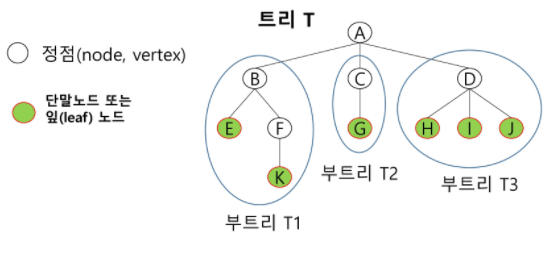
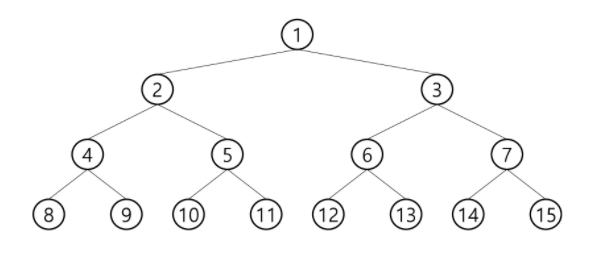
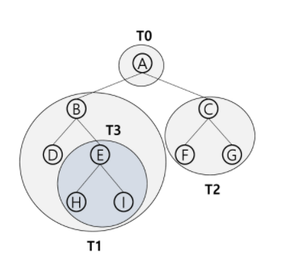
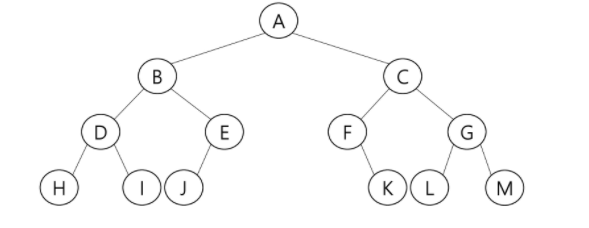

# Tree

* 비선형 구조 

* 1:n 관계, 계층관계를 가지는 계층형 자료구조

* 한개 이상의 노드로 이루어진 유한집합

  * 루트 : 노드 중 최상위 노드
  * 나머지 노드들은 n개의 집합 T1.. TN으로 분리될 수 있다.
    * 부 트리(subtree) : T1 ... TN

  * 정점(node, vertex)
  * 단말노드 또는 잎(leaf)노드(마지막 노드)

#### 용어

* 노드(node) : 트리의 원소
  * A, B, C, D, E, F, G, H, I, J, K
* 간선(edge) : 노드를 연결하는 선. 부모 노드와 자식노드 연결
* 루트 노드(root node) : 트리의 시작 노드
  * 루트노드 : A
  * 트리 - 1:N / 그래프 - N:N
* 형제 노드(sibling node) : 같은 부모 노드의 자식 노드들
  * B, C, D 는 형제 노드
* 조상 노드 : 간선을 따라 루트 노드까지 이르는 경로에 있는 모든 노드들
  * K의 조상 노드 : F, B, A
* 부 트리(subtree) : 부모 노드와 연결된 간선을 끊었을 때 생성되는 트리
* 자손 노드 : 서브 트리에 있는 하위 레벨의 노드들
  * B의 자손 노드 : E, F, K
* 차수
  * 노드의 차수 : 노드에 연결된 자식 노드의 수
    * B의 차수 : 2, C의 차수 : 1
  * 트리의 차수 : 트리에 있는 노드의 차수 중에서 가장 큰 값
    * 트리 T의 차수 : 3
  * 단말 노드(리프 노드) : 차수가 0인 노드
    * E, F ,G, H, I, J
* 높이
  * 노드의 높이 : 루트에서 노드에 이르는 간선의 수. 노드의 레벨
    * A : 레벨 0 - 높이 0
    * B, C, D : 레벨 1 - 높이 1
    * E, F, G, H, I, J : 레벨2 - 높이 2
    * K : 레벨 3 - 높이 3
  * 트리의 높이 : 트리에 노드 높이 중 가장 큰 값
    * 트리 T의 높이 : 3



### 이진트리

> 모든 노드들이 2개의 서브트리를 갖는 특별한 형태의 트리

* 각 노드가 자식 노드를 최대 2개만 가질 수 있는 트리

* 레벨 i에서의 노드의 최대 개수는 2^i개
* 높이가 h인 이진 트리가 가지 수 있는 노드
  * 최소 개수 : (h+1)
  * 최대개수 : 2^(h+1) -1

#### 종류

**포화 이진 트리(Full Binary Tree)**

* 모든 레벨에 노드가 포화상태로 차 있는 이진 트리
* 높이가 h일 때, 최대 노드 개수인 (2^(h+1) - 1)의 노드를 가진 이진 트리
* 루트를 1번으로 하여 2^(h+1)-1까지 정해진 위치에 대한 노드 번호를 가짐

**완전 이진 트리(Complete Binary Tree)**

* 높이가 h이고 노드 수가 n개 일때, 포화 이진 트리의 노드 번호 1번부터 n번까지 빈 자리가 없는 이진 트리
* 노드 번호는 포화 이진 트리에서 매기는 방식과 같음



**편향 이진 트리(Skewed Binary Tree)**

* 높이 h에 대한 최소 개수의 노드를 가지면서 한쪽 방향의 자식 노드만을 가진 이진 트리
  * 왼쪽 편향 이진 트리
  * 오른쪽 편향 이진 트리

#### 순회

> 트리의 각 노드를 중복되지 않게 전부 방문하는 것
>
> 트리는 비 선형 구조이기 때문에 선형구조에서와 같이 선후 연결 관계는 알 수 없음 => 특별한 방법 필요


#### 순회방법

> 1 : 루트 2: 왼쪽 서브트리 3: 오른쪽 서브트리

* 전위 순회 ( preorder traversal ) : VLR
  * 부모노드 방문 후, 자식노드를 좌,우 순서로 방문
  * 1 -> 2 -> 3
* 중위 순회 (inorder traversal) : LVR
  * 부모노드 기준
  * 왼쪽 자식노드, 부모노드, 오른쪽 자식노드 순으로 방문
  * 2 -> 1 -> 3

* 후위순회 ( postoder traversal) : LRV
  * 자식노드를 좌우 순서로 방문한 후, 부모드로 방문
  * 2 -> 3 -> 1

##### 전위 순회

1. 현재 노드 n을 방문하여 처리
2. 현재 노드 n의 왼쪽 서브트리로 이동
3. 현재 노드 n의 오른쪽 서브트리로 이동

```
def preorder_traverse(T):  # 전위순회
	if T :   # T is no None
		visit(T)  # 출력
		preorder_traverse(T.left)
		preorder_traverse(T.right)
```



* 순서 1 : T0 -> T1 -> T2
* 순서 2 : A -> B D T3 -> C F G
* 총 순서 : A B D E H I C F G

```
pre(A) : visit(A) pre(A.left) pre(A.right)
pre(A.left = B) : visit(B) pre(B.left) pre(B.right)
pre(B.left = D) : visit(D) # 자식 x return
pre(B.right = E) : visit(E) pre(E.left) pre(E.right)
pre(E.left = H) : visit(H) # 자식 x return
pre(E.right = I) : visit(I) # 자식 x return
pre(A.right = C) : visit(C) pre(C.left) pre(C.right)
pre(C.left = F) : visit(F) # 자식 x return
pre(C.right = G) : visit(G) # 자식 x return
A V D E H I C F G
```


##### 중위 순회

1. 현재 노드 n의 왼쪽 서브트리로 이동
2. 현재 노드 방문하여 처리
3. 현재 노드 n의 오른쪽 서브트리로 이동


* 순서 1 : T1 -> T0 -> T2
* 순서 2 : D B T3 -> A -> F C G
* 총 순서 : D B H E I A F C G

##### 후위 순회

1. 현재 노드 n의 왼쪽 서브트리
2. 오른쪽 서브트리
3. 부모


* 순서 1 : T1 -> T2 -> T0
* 순서 2 : D T3 B -> F G C -> A
* 총 순서 : D H I E B F G C A

##### 연습문제



* 전위 순회 : A B D H I E J C F K G L M
* 중위 순회 : H D I B J E A F K C L G M
* 후위 순회 : H I D J E B K F L M G C A


#### 이진트리의 표현

##### 배열

* 이진 트리에 각 노드 번호르 부여(완전 이진 트리)
* 루트의 번호를 1로 함

* 노드 번호의 성질 : 노드 번호 i
  * 부모 노드 번호 : i//2
  * 왼쪽 노드 번호 : 2 * i
  * 오른쪽 노드 번호 : 2*i + 1
  * 레벨 n의 노드 번호 시작 번호 : 2**n


##### * 이진 트리의 저장

```python
'''
4
1 2 1 3 3 4 3 5
'''
def pre_order(v):
    if v:  # 0번 정점이 없으므로 ( 0번은 자식이 없는 경우를 표시 )
        print(v)  # visit(v)
        pre_order(ch1[v])
        pre_order(ch2[v])

def in_order(v):
    if v:
        in_order(ch1[v])
        print(v)
        in_order(ch2[v])

def post_order(v):
    if v:
        post_order(ch1[v])
        post_order(ch2[v])
        print(v)

E = int(input())  # edge 수
arr = list(map(int, input().split()))
V = E + 1  # 정점 수 == 1번부터 V번까지 정점이 있을 때 마지막 정점번호

# 부모번호를 인덱스로 자식번호 저장
ch1 = [0] * (V+1)
ch2 = [0] * (V+1)
for i in range(E):
    p, c = arr[i*2], arr[i*2+1]
    if ch1[p] == 0 :  # 아직 자식이 없을 때
        ch1[p] = c
    else:
        ch2[p] = c

# pre_order(1)
# pre_order(3)
# in_order(1)
# post_order(3)

# 자식 번호를 인덱스로 부모번호 저장
par = [0] * (V+1)
for i in range(E) :
    p, c = arr[i*2] , arr[i*2+1]
    par[c] = p

# print(*par)

# root 찾기
for i in range(1, V+1):
    if par[i] == 0:
        root = i
        break
# print(root)

# 조상 찾기
c = 5
anc = []
while par[c] != 0:
    anc.append(par[c])
    c = par[c]
# print(*anc)
```


* 연결 리스트


### 수식 트리

> 수식을 표현하는 이진 트리

* 연산자는 루트 노드이거나 가지 노드
* 피연산자는 모두 잎 노드


### 이진 탐색 트리

> 탐색 작업을 효율적으로 하기 위한 자료구조

* 모든 원소는 서로 다른 유일한 키를 갖는다.
* key(왼쪽 서브트리) < key(루트 노드) < key(오른쪽 서브트리)
* 왼쪽 서브트리와 오른쪽 서브트리도 이진 탐색 트리.
* 중위 순회하면 오름차순으로 정렬된 값을 얻을 수 있다.

#### 연산

##### 탐색 연산

* 루트에서 시작
* 탐색할 키 값(x)을 루트 노드의 키 값(r)과 비교
  * (x = r) : 원하는 원소를 찾았으므로 탐색연산 성공
  * (x < r) : 루트노드의 왼쪽 서브트리에 대하여 탐색연산 수행
  * (x > r) : 루트노드의 오른쪽 서브트리에 대하여 탐색연산 수행
* 서브트리에 대해서 순환적으로 탐색연산 반복

##### 삽입연산

1. 먼저 탐색 연산 수행
   * 같은 원소 있으면 삽입 불가
   * 탐색 실패가 결정되는 위치가 삽입 위치
2. 탐색 실패한 위치에 원소 삽입

* 탐색, 삽입, 삭제 시간은 트리의 높이만큼 시간이 걸린다.
  * O(h), h:BST의 깊이(height)
* 평균의 경우
  * 이진 트리가 균형적으로 생성되는 경우
  * O(logn)
* 최악의 경우
  * O(n)
  * 한쪽으로 치우친 경사 이진트리의 경우(중간값이 root인 경우)

##### 연산 연습

* 삭제연산


### 힙(heap)

> 완전 이진 트리에 있는 노드 중에서 키값이 가장 큰 노드나 키값이 가장 작은 노드를 찾기 위해서 만든 자료구조

* 최대 힙(max heap)
  * 키 값이 가장 큰 노드를 찾기 위한 완전 이진 트리
  * 부모노드의 키값 > 자식노드의 키값
  * 루트 노드 : 키값이 가장 큰 노드
* 최소 힙(min heap)
  * 키값이 가장 작은 노드를 찾기 위한 완전 이진 트리
  * 부모노드의 키값 < 자식노드의 키값
  * 루트 노드 : 키값이 가장 작은 노드

