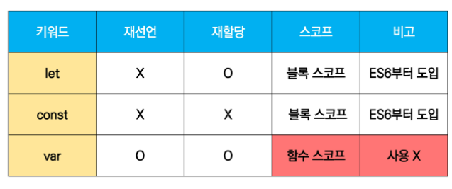
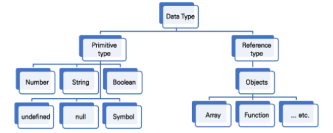
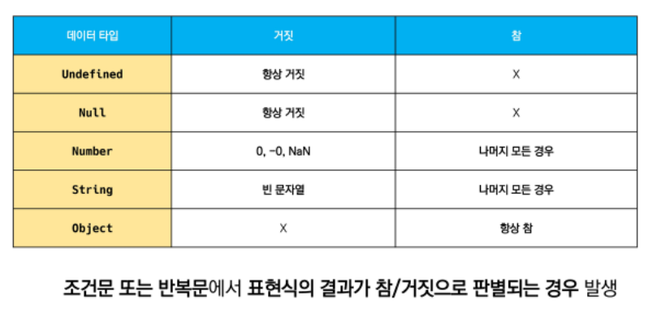
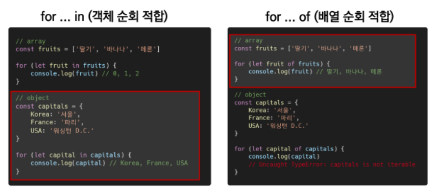

# JavaScript

### Introduction

* DOM(Document Object Model)
  * HTML, XML과 같은 문서를 다루기 위한 문서 프로그래밍 인터페이스
  * 문서를 구조화하고 구조화된 구성 요소를 하나의 객체로 취급하여 다루는 논리적 트리 모델
  * 문서가 구조화되어 있으며, 각 요소는 객체로 취급
  * 단순한 속성 접근, 메서드 활용뿐만 아니라 프로그래밍 언어적 특성을 활용한 조작 가능


* BOM (Browser Object Model)
  * 자바스크립트가 브라우저와 소통하기 위한 모델
  * window 객체는 모든 브라우저로부터 지원받으며 브라우저의 창을 지칭
  * BOM안에 DOM (브라우저(BOM)와 그 내부의 문서(DOM)를 조작하기 위해 ECMAScript(JS)를 학습)
* JavaScript Core
  * 프로그래밍 언어 ( 톱, 망치 )
* ECMA?
  * 정보 통신에 대한 표준을 제정하는 비영리 표준화 기구
  * ECMAScript6는 ECMA에서 제안하는 6번째 표준 명세


### 변수와 식별자


#### 식별자

* 변수를 구분할 수 잇는 변수명

* 식별자는 반드시 문자. $, _ 로 시작

* 대소문자를 구분하여, 클래스명 외에는 모두 소문자로 시작

* 예약어 사용 불가능 (예약어 : for, if, function 등)


#### 변수 선언 키워드


  |            let             |             const             |
  | :------------------------: | :---------------------------: |
  | 재할당 할 예정인 변수 선언 | 재할당 할 예정 없는 변수 선언 |
  |     변수 재선언 불가능     |      변수 재선언 불가능       |
  |        블록 스코프         |          블록 스코프          |

* 선언 : 변수를 생성하는 행위 또는 시점

* 할당 : 선언된 변수에 값을 저장하는 행위 또는 시점

* 초기화 : 선언된 변수에 처음으로 값을 저장하는 행위 또는 시점

* 블록 스코프 

  * if, for, 함수 등의 중괄호 내부를 가리킴

  * 블록 스코프를 가지는 변수는 블록 바깥에서 접근 불가능

  * ```javascript
    let x = 1
    
    if (x===1) {
        let x = 2
        console.log(x) //2
    }
    
    console.log(x) //1
    ```


```javascript
//let
let number = 10
number = 10  // 재할당

console.log(number) // 10
```

```javascript
// const
const number = 10
number = 10  // 재할당 불가
=> Uncaught TypeError : Assignment to constant variable.
```


##### var

* 재선언 및 재할당 가능

* 호이스팅 되는 특성

  * 변수를 선언 이전에 참조 가능
  * 변수 선언 이전 위치에서 접근 시 undefined

* 함수 스코프

  * 함수의 중괄호 내부

  * 함수 스코프를 가지는 변수는 함수 바깥에서 접근 불가

  * ```javascript
    function foo(){
        var x = 5
        console.log(x) //5
    }
    console.log(x) // ReferenceError : x is not defined
    ```

  * 

```javascript
var number = 10
var number = 50

console.log(number) // 50
```


```
Q1. 자바스크립트 변수 선언 시 사용 가능한 키워드는 const와 let 뿐이다.
F : const, let, var
Q2. const 키워드로 선언한 변수는 재할당이 가능하다.
F : const는 재할당 불가능
Q3. let 키워드로 선언한 변수는 재할당이 가능하다.
T
```



### 데이터 타입




* 원시 타입(Primitive type)

  * 객체(object)가 아닌 기본 타입
  * 변수에 해당 타입의 값이 담김
  * 다른 변수에 복사할 때 실제 값이 복사됨

  ```javascript
  let message = 'hi'
  
  let greeting = message
  console.log(greeting)  // 'hi'
  
  message = 'Hello,world'
  console.log(greeting)  // 'hi'
  //=> 원시 타입은 실제 해당 타입의 값 변수에 저장
  ```

  * 숫자 (Number) 타입

    * 정수, 실수 구분 없는 숫자 타입
    * 부동소수점 형식을 따름
    * NaN (Not A Number)
      * 계산 불가능한 경우

  * 문자열 

    * 텍스트 데이터

    * 작은따옴표 또는 큰따옴표

    * 템플릿 리터럴(Template Literal)

      * 따옴표 대신 backtick(``)으로 표현

      * ```javascript
        const name = 'Brandan'
        const printName = `${name}입니다.`
        
        console.log(printName)  // Brandan입니다.
        ```

  * undefined

    * 변수의 값 없음을 나타내는 데이터 타입
    * 변수 선언 이후 직접 값을 할당하지 않으면 자동으로 undefined 할당

  * null

    * 변수의 값이 없음을 의도적으로 표현
    * null 타입과 typeof 연산자
      * typeof 연산자 : 자료형 평가를 위한 연산자
      * null 타입은 원시 타입에 속하지만, typeof null의 결과는 객체로 표현

  * Boolean 타입

    * 논리적 참 또는 거짓을 나타내는 타입
    * true 또는 false 로 표현

    

* 참조 타입(Reference type)

  * 객체(object)타입의 자료형
  * 변수에 해당 객체의 참조 값이 담김
  * 다른 변수에 복사할 때 참조 값 복사
  * 함수, 배열, 객체

  ```javascript
  const message = ['hi']
  
  const greeting = message
  console.log(greeting)  // ['hi']
  
  message[0] = 'Hello,world'
  console.log(greeting)  //['Hello,world']
  
  //=> 참조 타입은 해당 객체를 참조할 수 있는 참조 값을 저장한다.
  ```


### 연산자

#### 할당 연산자

* 오른쪽 피연산자의 평가 결과를 왼쪽 피연산자에 할당하는 연산자
* 다양한 연산에 대한 단축 연산자 지원

```javascript
let x = 0

x += 10
console.log(x)  // 10

x -= 3
console.log(x) // 7

x *= 10
console.log(x) // 707

x /= 10
console.log(x) //7

x++  // += 과 동일
console.log(x) // 8

x--  // -= 과 동일
console.log(x) // 
```


#### 비교 연산자

* 피연산자들(숫자, 문자, Boolean 등)을 비교하고 결과값을 boolean으로 반환하는 연산자
* 문자열은 유니코드 값을 사용하며 표준 사전 순서를 기반으로 비교
  * 알파벳 순서상 후순위 숫자 큼, 소문자가 대문자보다 큼

```javascript
const numOne = 1
const numTwo = 100
console.log(numOne < numTwo) // true

const char1 = 'a'
const char2 = 'z'
console.log(char1 > char2) // false
```


#### 동등 비교 연산자 (==)  // 일치 비교 연산자 (===)

* 동등 비교 연산자 == 
  * boolean값 반환
  * 비교할 때 암묵적 타입 변환을 통해 타입을 일치시킨 후 값 비교
  * 두 피연산자가 모두 객체일 경우 메모리의 같은 겍체를 바라보는지 판별

* 일치 비교 연산자 ===
  * boolean 값 반환
  * 엄격한 비교 : 두 비교 대상의 타입 값 모두 같은지 비교
  * 두 피연산자가 모두 객체일 경우 메모리의 같은 객체를 바라보는지 판별

```javascript
const a = 1004
const b = '1004'
console.log(a == b)  // true
console.log(a === b) // false

const c = 1
const d = true
console.log(c == d) // true
console.log(c === d)  // false
```


#### 논리 연산자

* 세가지 논리 연산자
  * and  => `&&`
  * or => `||`
  * not => `!`
* 단축 평가 지원
  * ex ) false && true  => false
  * ex) true || false => true


#### 삼항 연산자

* 세 개의 피연산자를 사용하여 조건에 따라 값을 반환하는 연산자
* 가장 왼쪽 조건이 참이면 콜론 앞 값, 아니면 콜론 뒤 값
* 삼항 연산자의 결과 값이기 때문에 변수에 할당 가능

```javascript
console.log(true ? 1 : 2)  // 1
console.log(false ? 1 : 2)  // 2

const result = Math.PI > 4 ? 'YES' : 'NO'
console.log(result)  // NO
```


```
Q1. 자바스크립트의 데이터 타입은 크게 원시 타입과 참조 타입으로 분류된다.
T
Q2. Number 타입은 0을 제외한 모든 경우 참으로 자동 형변환이 이뤄진다.
F : 0, -0, NaN을 제외하고 참으로 형변환
Q3. 일치 비교 연산자(===)는 자동 형변환을 통해 타입과 값이 같은지 판별한다.
F : 자동 형변환 일어나지 않는다.
```


### 조건문

* `if` statement
  * 조건 표현식의 결과값을 Boolean 타입으로 변환 후 참/거짓 판단
* `switch` statement
  * 조건 표현식의 결과값이 어느 값에 해당하는지 판별
  * 주로 특정 변수의 값에 따라 조건을 분기할 때 활용
    * 조건이 많아질 경우 if문보다 가독성 나을 수 있음


#### if statement

```javascript
const nation = 'Korea'

if (nation === 'Korea') {
	console.log('안녕하세요')    
} else if (nation === 'France') {
	console.log('Bonjour')
} else {
	console.log('Hello')    
}
```


#### switch

* 표현식 결과 값을 이용한 조건문

```javascript
const nation = 'Korea'

switch(nation) {
    case 'Korea':{
        console.log('안녕하세요')
        break
    }
    case 'France':{
        console.log('Bonjour')
        break
    }
    default:{
        console.log('Hello')
        break
    }
}
// 안녕하세요
```

```javascript
const nation = 'Korea'

switch(nation) {
    case 'Korea':{
        console.log('안녕하세요')
    }
    case 'France':{
        console.log('Bonjour')
    }
    default:{
        console.log('Hello')
    }
}
// 안녕하세요
// Bonjour
// Hello
```


### 반복문

* while / for
* for ... in
  * 주로 객체의 속성들을 순회할 때 사용
  * 배열도 순회 가능하지만 인덱스 순으로 순회한다는 보장이 없으므로 권장하지 않음
* for ... of 
  * 반복 가능한(iterable)* 객체를 순회하며 값을 꺼낼 때 사용
    * 반복 가능한 객체의 종류 : Array, Map, Set, String 등


#### while

* 조건문이 참인 동안 반복 시행

```javascript
let i = 0

while (i<6){
    console.log(i)
    i += 1
}
```


#### for

* 세미콜론으로 구분되는 세 부분으로 구성
  * 첫부분 : 최초 반복문 진입 시 1회만 실행되는 부분
  * 중간 : 매 반복 시행 전 평가
  * 마지막: 매 반복 시행 이후 평가되는 부분

```javascript
for (let i=0; i<6; i++){
    console.log(i)
}
```


#### for ... in

* 객체(object)의 속성(key)들을 순회할 때 사용
* 배열도 순회 가능하지만 권장하지 않음
* 실행할 코드는 중괄호 안에 작성

```javascript
const capitals = {
    korea: 'seoul',
    USA: 'washington D.C'
}
for (let capital in capitals){
    console.log(capital)  // korea, USA
}
```


#### for ... of

* 반복 가능한 객체를 순회하며 값을 꺼낼 때 사용

```javascript
const fruits = ['strawberry', 'banana','melon']
for (let fruit of fruits){
    fruit = fruit + '!'
    console.log(fruit)
}
```




```
Q1. while문은 break문을 필수적으로 작성해야한다.
F : 선택적으로 사용 가능
Q2. for ... of 구문은 객체의 속성값 순회에 유용하다.
F : for of는 객체 순회에 사용할 수 없다. (for in이 유용)
Q3. for ... in 구문은 반복 가능한 객체의 순회에만 사용된다.
F : for in 은 반복 가능한 객체 순회 뿐 아니라 객체 순회에도 사용할 수 있으며, 객체의 속성값 순회에 더 유용하다.
```


### 함수

* 참조 타입 중 하나로써 function
* 함수 선언식 / 함수 표현식
* JavaScript 함수는 일급 객체에 해당
  * 일급 객체: 다음의 조건들을 만족하는 객체를 의미함
    * 변수에 할당 가능
    * 함수의 매개변수로 전달 가능
    * 함수의 반환 값으로 사용 가능


#### 함수 선언식

* 3가지 부분으로 구성 : 함수 이름, 매개변수, 몸통

```javascript
function add(num1, num2){
    return num1 + num2
}

add(1,2)
```

#### 함수 표현식

* 함수의 이름을 생락하고 익명 함수로 정의 가능
  * 익명함수 : 이름이 없는 함수
* 3가지 부분으로 구성 : 함수 이름(생략가능), 매개변수, 몸통

```javascript
const add = function (num1, num2) {
    return num1 + num2
}
```


#### 기본 인자

* 인자 작성 시 '=' 문자 뒤 기본 인자 선언 가능

```javascript
const greeting = function (name='Anonymous'){
    return `Hi ${name}`
}

greeting)() // Hi Anonymous
```


#### 매개변수와 인자의 개수 불일치 허용

```javascript
const noArgs = function(){
    return 0
}

noArgs(1, 2, 3)  // 0

const threeArgs = function(arg1, arg2, arg3){
    return [arg1, arg2, arg3]
}

threeArgs(1)  // [1, undefined, undefined]
```


#### Rest Parameter

* rest parameter(...) 를 사용하면 함수가 정해지지 않은 수의 매개변수를 배열로 받음

```javascript
const restOpr = function(arg1, arg2, ...restArgs){
    return [arg1, arg2, restArgs]
}

restArgs(1,2,3,4,5)  // [1,2,[3,4,5]]
restArgs(1,2) // [1,2,[]]
```


#### Spread operator

* spread operator(...)를 사용하면 배열 인자를 전개하여 전달 가능

```javascript
const spreadOpr = function (arg1, arg2, arg3){
    return arg1+arg2+arg3
}
const numbers = [1,2,3]
spreadOpr(...numbers) // 6
```


#### 선언식 vs 표현식

|        | 함수 선언식                                       | 함수 표현식                      |
| :----: | :-----------------------------------------------: | :------------------------------: |
| 공통점 | 데이터 타입                                   |함수 구성 요소(이름, 매개변수, 몸통)|
| 차이점 | 익명 함수 불가능<br />호이스팅 O                  | 익명 함수 가능 <br /> 호이스팅 X |
| 비고   |                                                   | Airbnb Style Guide 권장 방식 |

```javascript
// 함수 선언식
function sub(args){}
//함수 표현식
const add = function(args){}

console.log(typeof sub) // function
console.log(typeof add) // function
```

##### 호이스팅(hoisting)

##### 	함수 선언식

* 함수 선언식으로 선언한 함수는 hoisiting 발생

```javascript
add(2,7) // 9

function add (num1, num2){
    return num1 + num2
}
```

##### 함수 표현식

* 함수 표현식으로 선언한 함수는 함수 정의 전에 호출 시 에러 발생
* 함수 표현식으로 정의된 함수는 변수로 평가되어 변수의 scope 규칙을 따름

```javascript
sub(7,2) // Uncaught ReferenceError

const sub = function (num1, num2) {
    return num1 - num2
}
```

* 함수 표현식을 var 키워드로 작성한 경우, 변수가 선언전 undefined로 초기화 되어 다른 에러 발생

```javascript
console.log(sub) // undefined
sub(7,2) // Uncaught TypeError

var sub = function (num1, num2) {
    return num1-num2
}
```


### Arrow Function

* 함수를 비교적 간결하게 정의할 수 있는 문법
* function 키워드 생력 가능
* 매개변수 하나라면 () 생략 가능
* 몸통이 표현식 하나라면 {}와 return 생략 가능

```javascript
const arrow1 = function (name) {
    return `hello. ${name}`
}
//1. function 키워드 삭제
const arrow2 = (name) => {return `hello, ${name}`}
//2. 매개변수 1개라 ()생략 가능
const arrow3 = name => {return `hello, ${name}`}
//3. 함수 몸통에 표현식 한개라서 {}&return 생략 가능
const arrow4 = name => `hello, ${name}`
```

```
Q1. 함수에 대한 typeof 연산자의 결과는 object 이다.
F : function
Q2. 함수 선언식과 표현식 모두 익명 함수로 선언이 가능하다.
F : 한수 선언식은 불가능
Q3. 화살표 함수는 바디가 한줄이라면 중괄호와 return 구문이 생략 가능하다.
T
```


### 문자열 (String)

| includes | 특정 문자열의 존재 여부를 참/거짓으로 반환 |                                            |
| :------: | :----------------------------------------: | :----------------------------------------: |
|  split   |   문자열을 토큰 기준으로 나눈 배열 반환    | 인자 없으면 기존 문자열을 배열에 담아 반환 |
| replace  | 해당 문자열을 대상 문자열로 교체하여 반환  |                 replaceAll                 |
|   trim   |      문자열의 좌우 공백 제거하여 반환      |             trimStart, trimEnd             |

#### includes

* `string.includes(value)`
* 문자열에 value가 존재하는지 판별 후 참 또는 거짓 반환

```javascript
const str = 'a santa at nasa'

str.includes('santa') // true
str.includes('asan')  // false
```


#### split

* `string.split(value)`
* value 없을 경우, 기존 문자열을 배열에 담아 반환
* value가 빈 문자열일 경우 각 문자로 나눈 배열 반환
* value가 기타 문자열일 경우, 해당 문자열로 나눈 배열 반환

```javascript
const str = 'a cup'

str.split() // ['a cup']
str.split('') //['a',' ','c','u','p']
str.split(' ') // ['a', 'cup']
```


#### replace

* `string.replace(from, to)`
  * 문자열에 from 값이 존재할 경우, 1개만 to 값으로 교체하여 반환
* `string.replaceAll(from, to)`
  * 문자열에 from 값이 존재할 경우, 모두 to 값으로 교체하여 반환

```javascript
const str = 'a b c d'

str.replace(' ', '-') // 'a-b c d'
str.replaceAll(' ', '-') // 'a-b-c-d'
```


#### trim

* `string.trim()`
  * 문자열 시작과 끝의 모든 공백문자를 제거한 문자열 반환
* `string.trimStart()`
  * 문자열 시작의 공백 문자를 제거한 문자열 반환
* `string.trimEnd()`
  * 문자열 끝의 공백문자를 제거한 문자열 반환

```javascript
const str = '	hello	'

str.trim()  // 'hello'
str.trimStart()  //'hello	'
str.trimEnd()  //'	hello'
```


### 배열

* 키와 속성들을 담고 있는 참조 타입의 객체
* 순서를 보장하는 특징이 있음
* 주로 대괄호를 이용하여 생성, 0을 포함한 양의 정수 인덱스로 특정 값에 접근 가능
* 배열의 길이는 array.length 형태로 접근 가능
  * 배열의 마지막 원소는 array.length - 1로 접근

|     메서드      |                  설명                  |           비고           |
| :-------------: | :------------------------------------: | :----------------------: |
|     reverse     |   원본 배열의 요소 순서 반대로 정렬    |                          |
|   push & pop    |     가장 뒤에 요소 추가 또는 제거      |                          |
| unshift & shift |     가장 앞에 요소 추가 또는 제거      |                          |
|    includes     | 특정 값 존재하는지 판별 후 참/거짓반환 |                          |
|     indexOf     | 특정 값 존재하는지 판별 후 인덱스 반환 |   요소 없으면 -1 반환    |
|      join       |   모든 요소를 구분자를 이용하여 연결   | 구분자 생략 시 쉼표 기준 |


#### join

* `array.join([separator])`
  * 배열의 모든 요소를 연결하여 반환
  * separator(구분자)는 선택적으로 지정가능하며, 생략 시 쉼표를 기본 값으로 사용

```javascript
const numbers = [1, 2, 3, 4, 5]
let result

result = numbers.join()  
console.log(result)  // 1,2,3,4,5

result = numbers.join('')
console.log(result)  // 12345

result = numbers.join(' ')
console.log(result)  // 1 2 3 4 5

result = numbers.join('-')
console.log(result)  // 1-2-3-4-5
```


#### Spread operator

* spread operator(...)를 사용하면 배열 내부에서 배열 전개 가능
* ES5까지는 Array.concat() 메서드를 사용.
* 얕은 복사에 활용 가능

```javascript
const array = [1, 2, 3]
const newArray = [0, ...array, 4]

console.log(newArray)  // [0, 1, 2, 3, 4]
```


#### 배열 관련 메서드 (심화편)

* 배열을 순회하며 특정 로직을 수행하는 메서드
* 메서드 호출 시 인자로 callback 함수를 받는 것이 특징
  * callback 함수 : 어떤 함수의 내부에서 실행될 목적으로 인자로 넘겨받는 함수를 말함


| 메서드  |                             설명                             |
| :-----: | :----------------------------------------------------------: |
| forEach | 배열 각 요소에 대해 콜백 함수를 한 번씩 실행<br />반환 값 없음 |
|   map   |      콜백 함수의 반환 값을 요소로 하는 새로운 배열 반환      |
| filter  | 콜백 함수의 반환 값이 참인 요소들만 모아서 새로운 배열 반환  |
| reduce  |    콜백 함수 반환 값들을 하나의 값(acc)에 누적한 후 반환     |
|  find   |        콜백 함수의 반환 값이 참이면 해당 요소를 반환         |
|  some   |    배열의 요소 중 하나라도 판별 함수를 통과하면 참을 반환    |
|  every  |      배열의 모든 요소가 판별 함수를 통과하면 참을 반환       |


#### forEach

* 콜백 함수는 3가지 매개변수로 구성 : element, index, array

```javascript
array.forEach((element, index, array) =>{
    
})
```

```javascript
const fruits = ['딸기', '메론', '수박', '참외']

fruits.forEach((fruit, index) => {
    console.log(fruit, index)
    // 딸기 0
    // 메론 1
    // 수박 2
    // 참외 3
})
```

#### map

* 배열의 각 요소에 대해 콜백 함수를 한 번씩 실행
* 기존 배열 전체를 다른 형태로 바꿀 때 유용

```javascript
array.map((element, index, array) => {
    
})
```

```javascript
const numbers = [1, 2, 3, 4, 5]

const doubleNums = numbers.map((num) => {
    return num*2
})
const doubleNums = numbers.map(function (num){
    return num*2
})

console.log(doubleNums) // [2, 4, 6, 8, 10]
```

#### filter

* 배열의 각 요소에 대해 콜백 함수를 한 번씩 실행
* 기존 배열 요소 필터링할 때 요소

```javascript
array.filter((element, index, array) => {
    
})
```

```javascript
const numbers = [1, 2, 3, 4, 5]

const oddNums = numbers.filter((num, index) =>{
    return num % 2
})

console.log(oddNums) // 1, 3, 5
```

#### reduce

* 배열 각 요소에 대해 콜백 함수를 한 번씩 실행
* 매개변수 : acc ( 누적되는 변수 ), initialValue(optional) (acc 할당 값)

* 빈 배열의 경우 initialValue 제공하지 않으면 에러 발생

```javascript
array.reduce((acc, element, index, array)=>{
    
}, initalValue)
```

```javascript
const numbers = [1, 2, 3]

const result = numbers.reduce((acc, num) => {
    return acc + num
}, 0)
console.log(result) // 6
```

#### find

* 반환 값이 참이면, 조건을 만족하는 첫번째 요소 반환

* 찾는 값 배열에 없으면 undefined 반환

```javascript
const avengers = [
    {name : 'Tony', age: 45},
    {name : 'Thor', age: 40},
]

const result = avengers.find((avenger) => {
    return avenger.name === 'Tony'
})
console.log(result) //{name : 'Tony', age: 45}
```

#### some

* 배열의 요소 중 하나라도 주어진 판별 함수 통과하면 참
* 빈 배열은 항상 거짓

```javascript
const numbers = [1, 3, 5, 7, 9]

const hasEvenNumber = numbers.some((num)=>{
    return num % 2 === 0
})
console.log(result) // false

const hasOddNumber = numbers.some((num)=>{
    return num % 2
})
console.log(result) // true
```

#### every

* 배열의 모든 요소가 통과하면 참 반환
* 빈 배열은 항상 참

```javascript
const numbers = [1, 3, 5, 7, 9]

const isEveryNumberOdd = numbers.every((num)=>{
    return num % 2
})
console.log(isEveryNumberOdd) // true

const isEveryNumberEven = numbers.every((num)=>{
    return num % 2 === 1
})
console.log(isEveryNumberEven) // false
```


```
Q1. 배열은 원시 타입에 속하며 음수 인덱싱이 불가능하다는 특징이 있다.
F : 참조 타입
Q2. forEach 메서드는 배열의 각 요소들을 모아서 새로운 배열을 반환한다.
F : 반환하지 않는다. 저 설명은 map
Q3. 배열의 가장 마지막 요소를 추가하는 메서드는 append이다.
F : push
```


#### 객체(Object)

* 객체는 속성(property)의 집합이며, 중괄호 내부에 key와 value의 쌍으로 표현
* key는 문자열 타입만 가능
  * key이름에 띄워쓰기 등의 구분자가 있으면 따옴표로 묶어서 표현
* value는 모든 타입 가능
* 객체 요소 접근은 점 또는 대괄호로 가능
  * key이름에 띄어쓰기 같은 구분자가 있으면 대괄호 접근만 가능

```javascript
const me = {
    name : 'jack',
    phoneNumber : '01012345678'
    'samsung product' : {
    buds : 'Galaxy Buds',
    galaxy : 'Galaxy'
},
}

console.log(me.name)
console.log(me['samsung product'])
console.log(me['samsung product'].buds)
```


#### 객체와 메서드

* 메서드는 객체의 속성이 참조하는 함수
* 객체.메서드명() 으로 호출 가능
* 메서드 내부에서는 this 키워드가 객체를 의미

```javascript
const me = {
    firstName: 'John',
    lastName: 'Doe',
    fullName: this.firstName + this.lastName,  // 메서드 아니므로 NaN 출력 
    getFullName: function() {
        return this.firstName + this.lastName
    }  // 메서드이므로 정상 반환
}
```


#### 객체 관련 ES6 문법

##### 1. 속성명 축약

* 객체를 정의할 때 key와 할당하는 변수의 이름이 같으면 축약 가능

```javascript
var books = ['JS', 'Python']
var magazines = ['Vogue', 'Science']

var bookshop ={
    books: books,
    magazines: magazines,
}
```

```javascript
const books = ['JS', 'Python']
const magazines = ['Vogue', 'Science']

const bookShop = {
    books,
    magazines
}

// 출력 값 동일
```


##### 2. 메서드명 축약

* 메서드 선언 시 function 키워드 생략 가능

```javascript
var obj = {
    greeting : function () {
        console.log('hi')
    }
}
obj.greeting() // hi
```

```javascript
const obj = {
    greeting(){
        console.log('hi')
    }
}
obj.greeting() // hi
```


##### 3. 계산된 속성

* 객체를 정의할 때 key의 이름을 표현식을 이용하여 동적으로 생성 가능

```javascript
const key = 'regions'
const value = ['서울','대전']

const ssafy = {
    [key] : value,
}

console.log(ssafy)  //{regions: Array(2)}
console.log(ssafy.regions) // ['서울','대전']
```


##### 4. 구조 분해 할당

* 배열 또는 객체를 분해하여 속성을 변수에 쉽게 할당할 수 있는 문법

```javascript
const user = {
    name : 'dd',
    age : 20,
    balance: 100
}
```

```javascript
// 둘이 같음
const name = user.name
const { name } = user
```

```javascript
name 
// 'dd'
```

```javascript
const {erum} = user
// 동작하지 않음 (undefined)
```

```javascript
const {name, age, balance} = user
// 모두 할당 됨
```

```javascript
// 1.
function printUser(user){
    console.log(user.name, user.age, user.balance)
}
// 2.
function printUser({name, age, balance}){
    console.log(name, balance, age)
}
```

```javascript
printUser(user)
// dd, 100, 20
```


##### 5. Spread operator

* 객체 내부에서 객체 전개 가능

* 얕은 복사에 활용 가능

```javascript
const obj = {b:2, c:3, d:4}
const newObj = {a:1, ...obj, e:5}

console.log(newObj) // {a:1, b:2, c:3, d:4, e:5}
```


#### JSON

* key-value쌍의 형태로 데이터를 표기하는 언어 독립적 표준 포맷
* 자바스크립트의 객체와 유사하게 생겼으나 실제로는 문자열 타입
  * JS의 객체로써 조작하기 위해서는 구문 분석(parsing) 이 필수


* 자바스크립트에서 JSON 조작 위해 두가지 내장 메서드 제공
  * JSON.parse()
    * JSON => 자바스크립트 객체
  * JSON.stringify()
    * 자바스크립트 객체 => JSON


```
Q1.객체의 key값은 원시 타입만 사용 가능하다.
F: 객체의 key 값은 문자열 타입만 사용 가능하다.
Q2.객체 정의 시 key값과 key에 할당하는 변수의 이름이 같으면 축약 가능하다.
T
Q3. JSON 데이터는 문자열 타입으로 표현된다.
T
```


### this

* JS와 this는 실행 문맥에 따라 다른 대상을 가리킨다.
* class 내부의 생성자 함수
  * this는 생성되는 객체를 가리킴(Python self)
* 메서드(객체.메서드명()으로 호출 가능한 함수)
  * this는 해당 메서드가 소속된 객체를 가리킴
* 위의 두가지 경우를 제외하면 모두 최상위 객체(window)를 가리킴

```javascript
const me = {
    name : 'neo'.
    printName : function() {
        console.log(this.name)
    }
}
```

```javascript
me.printName()
// neo
```

```javascript
function getFullName(){
    return this.firstName + this.lastName
}
const me = {
    firstName:'예원',
    lastName: '정',
    'getFullName' : getFullName
}
```

```javascript
getFullName()
//NaN
```

```javascript
me.getFullName()  //'예원정'
// method일때의 this가 달라진다.
// this는 me 객체를 가르킨다.
// method가 아닐 때에는 window 지칭
```

```javascript
const you = {
    firstName: '준호',
    lastName: '김',
    qwer: getFullName
}
you.qwer() //'준호김'
```

