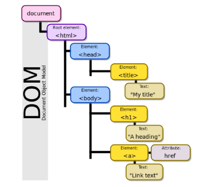

# DOM 조작과 Event

### DOM(Document Object Model)

#### 브라우저에서 할 수 있는 일

* DOM 조작
  * 문서(HTML) 조작
* BOM 조작
  * Navigator, screen, location, frames, history, XHR
* JavaScript Core (ECMAScript)
  * Data Structure(Object, Array), Conditional Expression, Iteration


#### DOM 이란?

* HTML, XML과 같은 무서를 다루기 위한 문서를 다루기 위한 문서 프로그래밍 인터페이스

* 문서를 구조화하고 구조화된 구성 요소를 하나의 객체로 취급하여 다루는 논리적 트리 모델

* 문서가 구조화되어 있으며 각 요소는 객체로 취급

* 단순한 속성 접근, 메서드 활용뿐만 아니라 프로그래밍 언어적 특성을 활용한 조작 가능

* 주요 객체

  * window : DOM 을 표현하는 창. 가장 최상위 객체 (작성 시 생략 가능)
  * document : 페이지 컨텐츠의 Entry Point 역할을 하며, <body> 등과 같은 수 많은 다른 요소들을 포함
  * navigator, location, history, screen

  

#### DOM - 해석

* 파싱 (Parsing)
  * 구문 분석, 해석
  * 브라우저가 문자열을 해석하여 DOM Tree로 만드는 과정

#### DOM - 조작

~~~javascript
document.title
// "삼성 청년 SW 아카데미"
document.title = 'Javascript'
// "Javascript"
~~~


#### BOM 이란?

* Browser Object Model
* 자바스크립트가 브라우저와 소통하기 위한 모델
* 브라우저의 창이나 프레임을 추상화해서 프로그래밍적으로 제어할 수 있도록 제공하는 수단
  * 버튼, URL 입력창, 타이틀 바 등 브라우저 윈도우 및 웹 페이지 일부분을 제어 가능
* window 객체는 모든 브라우저로부터 지원받으며 브라우저의 창을 지칭

#### BOM - 조작

~~~javascript
// 탭 창
window.open()
// window { window: window, self: Window, document: document, name: "", Location: Location, ...}

// 인쇄 창
window.print()
// undefined

// 메시지 및 확인, 취소 버튼이 있는 대화상자 창
window.confirm()
// false

// document도 브라우저 내에 종속되어 있기 때문에 window 전역 객체에 포함
window.document
// #document <!DOCTYP# html>
~~~


#### JavaScript Core

* 프로그래밍 언어

~~~javascript
const numbers = [1, 2, 3, 4, 5]
for (lent i = 0; i < numbers.length; i++) {
  console.log(numbers[i])
}
// 1
// 2
// 3
// 4
// 5
// undefined
~~~

### Event
* 네트워크 활동이나 사용자와의 상호작용 같은 사건의 발생을 알리기 위한 객체
* 이벤트 발생
	* 마우스를 클릭하거나 키보드를 누르는 등 사용자 행동으로 발생할 수 있음
	* 특정 메서드를 호출(Element.click())하여 프로그래밍적으로도 만들어 낼 수 있음

##### Event 기반 인터페이스
* AnimationEvent, ClipboardEvent, DragEvent 등
* UIEvent
	* 간단한 사용자 인터페이스 이벤트
	* 이벤트의 상속을 받음

##### Event의 역할
> ...하면, ...한다
"클릭하면, 경고창을 띄운다."
"특정 이벤트가 발생하면, 할 일을 등록한다."

##### Event handler - addEventListener()
* EventTarget.addEventListener()
	* 지정한 이벤트가 대상에 전달될 때마다 호출할 함수를 설정
	* 이벤트를 지원하는 모든 객체를 대상으로 지정 가능
* target.addEventListenr(type, listenr[, options])
	* type
		* 반응 할 이벤트 유형(대소문자 구분 문자열)
	* listener
		* 지정된 타입의 이벤트가 발생했을 때 알림을 받는 객체
		* 이벤트리스너 인터페이스 혹은 JS 함수 객체(콜백 함수) 여야함

```
##### DOM 관련 객체의 상속 구조(참고)
* EventTarget
	* Event Listener를 가질 수 있는 객체가 구현하는 DOM 인터페이스

```

* "대상에 특정 이벤트가 발생하면, 할 일을 등록하자"

```
EventTarget.addEventListener(type, listener)
```

##### Event 취소
* event.preventDefault()
* 현재 이벤트의 기본 동작을 중단
* HTML 요소의 기본 동작을 작동하지 않게 막음
	* ex ) a 태그의 기본동작은 클릭 시 링크로 이동 / form 태그의 기본 동작은 form 데이터 전송
* 이벤트를 취소할 수 있는 경우, 이벤트의 전파를 막지 않고 그 이벤트 취소

