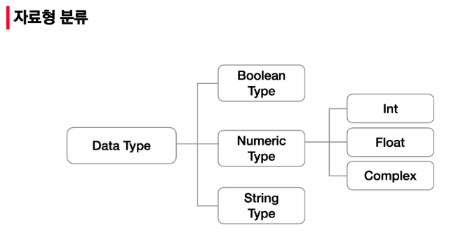

# PYTHON 01

## 파이썬 자료형

  


### None

* 값이 없음을 표현하기 위한 타입.

### 불린(Boolean)

* True / False 값을 가진 타입은 bool
  * False : `0, 0.0, (), [], {}`
* 비교 / 논리 연산 수행에 활용
* 함수 `bool()`

### 수치형(Numerical Type)

##### 정수(int)

* 오버플로우 발생 x

* 진수 표현
  * 2진수 : `0b` 8진수 : `0o` 16진수 : `0x`

##### 실수(Float)

* 부등소수점 : 실수를 컴퓨터가 표현하는 방법

  * floating point rounding error

    * ```python
      # 매우 작은 수보다 작은지 확인
      abs(a-b)<=1e-10
      ```

##### 복소수(Complex)

* 허수부를 j로 표현

### 문자열(String Type)

* 모든 문자는 str 타입

##### Escape sequence

* 문자열 내에서 특정 문자나 조작을 위하여 역슬래시(\\)로 구분

| 예약문자 |    내용(의미)     |
| :------: | :---------------: |
|    \n    |      줄 바꿈      |
|    \t    |        탭         |
|    \r    |    캐리지리턴     |
|    \0    |     널(Null)      |
|   \\\    |        `\`        |
|   \\'    | 단일인용부호(`'`) |
|   \\"    | 이중인용부호(`"`) |

##### String Interpolation

```python
print('Hello,{}! 성적은 {}'.format(name, score))
```

`Hello, Kim! 성적은 4.5`

```python
print(f'Hello,{name}! 성적은 {score}')
```

`Hello, Kim! 성적은 4.5`


## 컨테이너

* 여러 개의 값을 담을 수 있는 것(객체)
* 서로 다른 자료형을 저장할 수 있음
* ordered vs. unordered
* 순서가 있다 != 정렬되어 있다.


### 시퀀스형 컨테이너

##### 리스트(List)

* `[]` or `list()`
* 가변자료형, 순서가 있는 시퀀스

##### 튜플(Tuple)

* `()` or `tuple()`

* 수정불가능(불변형), 순서가 있는 자료형

* `my_tuple[i]` (index로 접근)

  * 주의 : `a = 1, ` `b = 1,2,3` 으로 단일과 복수항목에 차이.

* 튜플 대입

  * 우변의 값을 좌면의 변수에 할당.

  * ```python
    $x,y = (1,2)
    $print(x,y)
    1 2
    ```

##### 레인지(range)

* range(n) : 0부터 n-1까지의 숫자 시퀀스
* range(n, m) : n부터 m-1까지의 숫자 시퀀스
* range(n, m, s) : n부터 m-1까지 s만큼 증가시키는 숫자의 시퀀스

### 비시퀀스형 컨테이너

##### 셋(Set)

* `{}` or `set()`

* 가변자료형, 순서없음

* ```python
  ${1,2,3,1,2}
  {1,2,3}
  ```

  * { } : 빈 중괄호는 'dictionary'

##### 딕셔너리(Dictionary)

* key-value : `{}` or `dict()`
* 불변자료형, 순서없음

```python
$dict_a = {'a' : 'apple', 'b' : 'banana'}
$dict_a['a']
'apple'
```

###  형 변환(Typecasting)

##### 자료형 변호나

* 암시적 형 변환 :bool / numeric type(int,float,complex)

  * ```python
    $True + 3
    4
    $3 + 5.0
    8.0
    $3 + 4j + 5
    (8+4j)
    ```

* 명시적 형 변환

  * int

    * ```python
      $ int('3') + 4
      7
      ```

  * float

    * ```python
      $ float('3')
      3.0
      ```

### 연산자

##### 산술 연산자

* `+, -, * , /, //(몫), **(거듭제곱)`

##### 비교 연산자

* True / False
* `< , <= , >, >=, ==, !=(같지않음), is(객체 아이덴티티), is not(객체 아이덴티티 아닌 경우)`

##### 논리 연산자

* `A and B (A와 B 모두 True시,True), A or B (A와 B 모두 False시, False), Not(True를 False로 ,False를 True로)`
* and : 첫번째 값이 False이면 무조건 False => 첫번째 값 반환
* or : 첫번째 값이 True이면 무조건 True => 첫번째 값 반환

##### 복합 연산자

* 연산과 대입이 함께 이러우짐
* ex ) cnt +=1

##### 식별 연산자

* `is`

##### 멤버십 연산자

* `in, not in`

* ```python
  $'a' in 'apple'
  True
  ```

##### 시퀀스형 연산자

* 산술연산자 

  * ``` python
    $[1,2] + ['a']
    [1,2,'a']
    ```

* 반복연산자(*)

  * ```python
    $[0]*8
    [0,0,0,0,0,0,0,0]
    ```

* 인덱싱

  * ```python
    $[1,2,3][2]
    3
    $range(3)[2]
    2
    $'abc'[0]
    'a'
    ```

* 슬라이싱

  * [a : b : c] : a - 포함 b - 미포함 c - 간격

  * ```python
    $ [1,2,3,5][0:4:2]
    [1,3]
    ```

    

  * s[::] => 'abcdefghi'
  * s[::-1]=>'ihgfedcba'

##### 컨테이너 형 변환

