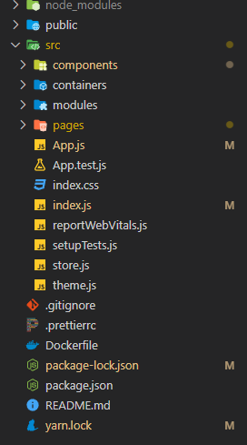

# React

> A JavaScript library for building user interface

* 사용자 인터페이스(User Interface, UI)
  * react는 UI 라이브러리


프레임워크 vs 라이브러리

프레임워크 : 흐름의 제어권이 자신에게 있다.

라이브러리 : 흐름이 개발자에게 있다.


### 리액트 장점

* 빠른 업데이트 & 렌더링 속도
* Virtual DOM
  * 웹페이지를 담고 있는 **가상**의 큰 그릇
  * Virtual DOM에서 업데이트 된 것 중 Browser DOM에서 필요한 것만 가져가서 변화 시킨다.
* Component-Based
* 재사용성
  * 의존성 문제와 호환성 문제 등으로 재사용이 어려울 수 있다.
  * 개발 기간이 단축 됨
  * 유지 보수가 용이함
  * 리액트는 컴포넌트 기반으로 재사용성이 높다.
* 활발한 지식공유 & 커뮤니티
* 리액트 네이티브
  * 모바일 웹


### 리액트 단점

* 방대한 학습량
  * 기존과 다른 UI 라이브러리
* 높은 상태관리 복잡도


# 리액트 시작

```
npx create-react-app my-app
npm start
```

##### 파일 구조




### Redux
* Redux Toolkit
* middleware

