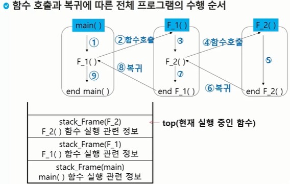

# Stack

> 물건을 쌓아 올리듯 자료를 쌓아 올린 형태의 자료구조
>
> 후입선출 ( LIFO : Last-In-First-Out )

* 스택에 저장된 자료는 선형구조

  * 선형구조 : 자료 간의 관계가 1대1의 관계를 갖는다
  * 비선형구조 : 자료간의 관계가 1대N의 관계를 갖는다 ( 예 : 트리 )

* 스택에 자료를 삽입하거나 스택에서 자료를 꺼낼 수 있다.

* 마지막으로 삽입한 자료를 가장 먼저 꺼낸다.(후입선출)

##### 스택을 프로그램에게 구현하기 위해서 필요한 자료구조와 연산
* 자료구조 : 자료를 선형으로 저장할 저장소
  * 배열을 사용할 수 있다.
  * 저장소 자체를 스택이라 부르기도 한다.
  * 스택에서 마지막 삽입된 원소의 위치를 top ( stack pointer)

##### 연산

* 삽입(push) : 저장소에 자료를 저장.

* 삭제(pop) : 저장소에서 자료를 꺼낸다. 꺼낸 자료는 삽입한 자료의 역순으로 꺼낸다.

* isEmpty : 스택이 공백인지 아닌지를 확인하는 연산
* peek : 스택의 top에 있는 원소를 반환하는 연산


##### 스택의 삽입/삭제 과정

* 빈 스택에 원소 A, B, C를 차례로 삽입 후 한번 삭제하는 연산과정

push A : top += 1 (stack [ A, 0, 0, 0])

push B : top += 1 (stack [ A, B, 0, 0])

push C : top += 1 (stack [ A, B, C, 0])

pop : C top -= 1 (stack [A, B, C, 0])


##### 스택의 push 알고리즘

> append 메소드를 통해 리스트의 마지막에 데이터를 삽입

```python
def push(item):
    s.append(item)
```

```python
def push(item, size):
    global top
    top += 1
    if top == size:
        print('overflow!')
    else:
        stack[top] = item

size = 10
stack = [0] * size
top = -1

push(10, size)

top += 1          # push(20)
stack[top] = 20   #
```


##### 스택의 pop 알고리즘

```python
def pop():
    if len(s) == 0:
        return
    else:
        return s.pop(-1)
```

```python
def pop():
    global top
    if top == -1:
        print('underflow')
        return 0
    else:
        top -= 1
        return stack[top+1]

print(pop())

if top > -1:  # pop()
    top -= 1
    print(stack[top+1])

while top >= 0:
    n = stack[top]
    top -= 1
    print(n)
```


```python
# 파이참
stack = []

stack.append(10)
stack.append(20)
stack.append(30)
print(stack.pop())  # 30
print(stack.pop())  # 20
print(stack.pop())  # 10
```


#### 스택 구현 고려 사항

* 1차원 배열 사용하여 구현할 경우 구현이 용이하다는 장점이 있지만 스택의 크기를 변경하기가 어렵다는 단점이 있다.
* 이를 해결하기 위한 방법으로 저장소를 동적으로 할당하여 스택을 구현하는 방법이 있다. 동적 연결리스트를 이용하여 구현하는 방법을 의미. 구현이 복잡하다는 단점이 있지만 메모리를 효율적으로 사용한다는 장점을 가진다. 스택의 동적 구현은 생략한다.


#### 스택의 응용1 : 괄호 검사

* [] , {} , ()
* 조건
  * 왼쪽 괄호 개수 = 오른쪽 괄호 개수
  * 같은 괄호에서 왼쪽 괄호는 오른쪽 괄호보다 먼저 나와야 한다.
  * 괄호 사이에는 포함 관계만 존재한다.

* 스택을 이용한 괄호 검사

```
if (   ( i == 0) && (  j == 0 )
```
1. 여는 괄호는 push
2. 닫는 괄호 나오면 top 괄호 삭제 후 여는 괄호와의 짝 확인


#### 스택의 응용2 : 함수 호출

* 프로그램에서의 함수 호출과 복귀에 따른 수행 순서를 관리




### Memoization

* 앞의 예에서 피보나치 수를 구하는 함수를 재귀로 구현한 알고리즘은 엄청난 중복 호출이 존재하여 문제.

* 메모이제이션은 이전에 계산한 값을 메모리에 저장해 다시 계산하지 않도록. 실행속도 빠르게 하는 기술
* fibo(n)의 값을 계산하자마자 저장하면 샐행시가늘 O(n)으로 줄일 수 있다.

```python
# memo를 위한 배열을 할당하고, 모두 0으로 초기화
# memo[0]을 0으로 mome[1]는 1로 초기화

def fibo1(n):
    global memo
    if n >= 2 and len(memo) <= n:
        memo.append(fibo1(n-1)+fibo1(n-2))
    return memo[n]

memo = [0, 1]
```

