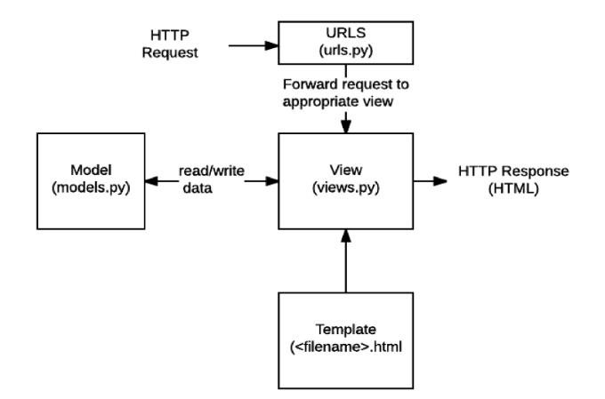
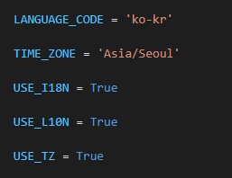
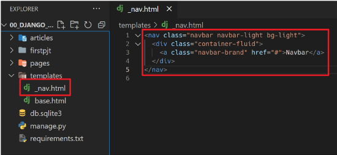
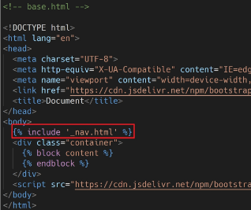

## Web Framework

#### Django

* Python Web framework

* focous on writing your app without needing to reinvent the wheel

#### Web

www : world wide web

인터넷에 연결된 컴퓨터를 통해 정보를 공유할 수있는 전 세계적인 정보 공간

#### static web page(정적 웹 페이지)

* 서버에 미리 저장된 파일이 사용자에게 그대로 전달되는 웹 페이지
* 서버가 정적 웹페이지에 대한 요청을 받은 경우 서버는 추가적 처리 과정 없이 클라이언트에게 응답 보냄
* 모든 상황에서 모든 사용자에게 동일한 정보 표시
* 일반적으로 HTML, CSS, JavaScript로 작성됨
* flat page라고도 함.

#### Dynamic web page(동적 웹 페이지)

* 웹 페이지에 대한 요청을 받는 경우 서버는 추가적인 처리 과정 이후 클라이언트에게 응답을 보냄
* 동적 웹 페이지는 방문자와 상호작용하기 때문에 페이지 내용은 그때그때 다름
* 서버 사이드 프로그래밍 언어(파이썬, 자바, 씨++등)가 사용되며, 파일을 처리하고 데이터베이스와의 상호작용이 이루어짐

#### Framework

* 프로그래밍에서 특정 운영 체제를 위한 응용 프로그램 표준 구조를 구현하는 클래스와 라이브러리 모임
* 재사용할 수 있는 수많은 코드를 프레임워크로 통합함으로써 개발자가 새로운 어플리케이션을 위한 표준 코드르 다시 작성하지 않아도 같이 사용할 수 있도록 도움
* Application framework 라고도 함

#### Web framework

* 웹 페이지를 개발하는 과정에서 겪는 어려움을 줄이는 것이 주 목적
* 데이터베이스 연동, 템플릿 형태의 표준, 세션 관리, 코드 재사용등의 기능을 포함
* 동적인 웹 페이지나, 웹 어플리케이션, 웹 서비스 개발 보조용으로 만들어지는 application framework의 일종

##### django 사용 이유

* 검증된 python 언어 기반 web framework
* 대규모 서비스에도 안정적이며 오랫동안 세계적인 기업들에 의해 사용됨
  * spotify, instagram, dropbox, delivery hero

#### Framework Architecture

* MVC Design Pattern (model-view-controller)
* 소프트웨어 공학에서 사용되는 디자인 패턴 중 하나
* 사용자 인터페이스로부터 프로그램 로직을 분리하여 애플리케이션의 시각적 요소나 이면에서 실행되는 부분을 서로 영향 없이 쉽게 고칠 수 있는 애플리케이션을 만들 수 있음
* Django는 MTV pattern

#### MTV Pattern

* Model
  * 응용프로그램의 데이터 구조를 정의하고 데이터베이스의 기록을 관리(추가, 수정, 삭제)
* Template
  * 파일의 구조나 레이아웃을 정의
  * 실제 내용을 보여주는데 사용(presentation)
* View
  * HTTP 요청을 수신하고 HTTP 응답을 반환
  * Model을 통해 요청을 충족시키는데 필요한 데이터에 접근
  * template에게 응답의 서식 설정을 맡김

|    MVC     |   MTV    |
| :--------: | :------: |
|   Model    |  Model   |
|    View    | Template |
| Controller |   View   |




### Django

1. 가상환경 생성 및 활성화

```dj
$ python -m venv venv
$ source venv/Script/activate
```

2. django 설치

```django
$ pip install django==3.2.12
```

3. 프로젝트 생성

```django
$ django-admin startproject projectname .
```

4. 서버 시작

```django
$ python manage.py runserver
```

```python
[프로젝트 구조]

1. `__init__.py`
   * python에게 이 디렉토리를 하나의 python 패키지로 다루도록 지시
2. `asgi.py`
   * Asynchronous Server Gateway Interface
   * Django 애플리케이션이 비동기식 웹서버와 연결 및 소통하는 것을 도움
3. `settings.py`
   * 애플리케이션의 모든 설정을 포함
4. `urls.py`
   * 사이트의 url과 적절한 views의 연결을 지정
5. `wsgi.py`
   * Web Server Gateway Interface
   * Django 애플리케이션이 웹서버와 연결 및 소통하는 것을 도움
6. `manage.py`
   * Django 프로젝트와 다양한 방법으로 상호작용하는 커맨드라인 유틸리티
```

5. Application 생성

```django
$ python manage.py startapp articles
```

```python
[Application 구조]

1. `admin.py`
* 관리자용 페이지를 설정 하는 곳
2. apps.py
* 앱의 정보가 작성된 곳
3. models.py
* 앱에서 사용하는 model을 정의하는 곳
4. tests.py
* 프로젝트의 테스트 코드를 작성하는 곳
5. views.py
* view 함수들이 정의 되는 곳
```

##### Project

* 프로젝트는 Application의 집합
* 프로젝트에는 여러 앱이 포함될 수 있음
* 앱은 여러 프로젝트에 있을 수 있음

##### Application

* 앱은 실제 요청을 처리하고 페이지를 보여주는 등의 역할을 담당
* 하나의 프로젝트는 여러 앱을 가짐
* 일반적으로 앱은 하나의 역할 및 기능 단위로 작성함

6. 앱 등록

* project - settings.py

```python
INSTALLED_APPS = [
    # Local apps
    'articles',
    
    # Third pary apps
    'djangorestframework',
    
    # django apps
    'django.contrib.admin',
    .....,
]
```

* INSTALLED_APPS
  * Django installation에 활성화 된 모든 앱을 지정하는 문자열 목록

* 반드시 앱 생성 후 등록하여야 함

* 위의 앱 등록 순서 지킬 것


### 요청과 응답

##### URLs

* HTTP 요청(request)을 알맞은 view로 전단

```python
# urls.py

from django.contrib import admin
from djago.urls import path
from articles import views

urlpatterns = [
    path('admin/', admin.site.urls),
    path('index/', views.index),
]
```

##### View

* HTTP 요청을 수신하고 응답을 반환하는 함수 작성
* Model을 통해 요청에 맞는 필요 데이터에 접근
* Template에게 HTTP 응답 서식을 맡김

```python
# views.py

from django.shortcuts import render

def index(request):
    return render(request, 'index.html')
```

##### Templates

* 실제 내용을 보여주는데 사용되는 파일
* 파일 구조나 레이아웃 정의(html)
* Template 파일 경로의 기본 값은 app 폴더 안의 templates 폴더로 지정되어 었음

```django
<!--articles/templates/index.html-->
<h1>
    만나서 반가워요!
</h1>
```


##### 추가설정

* LANGUAGE_CODE = 'ko-kr'
  * 모든 사용자에게 제공되는 번역을 결정
  * USE_I18N이 활성화 되어야 사용 가능!!
* TIME_ZONE = 'Asia/Seoul'
  * 데이터베이스 연결의 시간대를 나타내는 문자열
  * USE_TZ가 True이고 이 옵션이 셜정된 경우 데이터베이스에서 날짜 시간을 읽으면, UTC 대신 새로 설정한 시간대의 인식 날짜 & 시간이 반환됨
  * USE_TZ가 False인 상태로 값 설정시 error 발생

* USE_I18N
  * Django의 번역 시스템을 활성화 할지 지정
* USE_L10N
  * 데이터의 지역화된 형식을 기본적으로 활성화할지 지정
  * True일 경우, Django는 현재 locale의 형식을 사용하여 숫자와 날짜를 표시
* USE_TZ
  * datetimes가 기본적으로 시간대를 인식하는지 여부 짖ㅇ
  * True인 경우 Django는 내부적으로 시간대 인식 날짜 / 시간 사용




### Template

* 데이터 표현을 제어하는 도구이자 표현에 관련된 로직
* 사용하는 built-in system
  * django template language

#### Django Template Language (DTL)

* django template에서 사용하는 built-in template system
* 조건, 반복, 변수 치환, 필터 등의 기능을 제공
* 단순히 Python이 html에 포함된 것이 아니며, 프로그래밍적 로직이 아니라 프레젠테이션을 표현하기 위한 것
* python처럼 일부 프로그래밍 구조(if, for)를 사용할 수 있지만, 이건은 해당 pythoon 코드로 실행되는 것이 아님.

##### DTL Syntax

1. variable

   ```django
   {{ variable }}
   ```

   * render()를 사용하여 views.py에서 정의한 변수를 template 파일로 넘겨 사용하는 것
   * 변수명은 영어, 숫자와 밑줄(_)의 조합으로 구성될 수 있으나 밑줄로는 시작할 수 없음
     * 공백이나 구두점 문자 또한 사용불가
   * dot(.)을 사용하여 변수 속성에 접근할 수 있음
   * render()의 세번째 인자로 {'key':value}와 같이 딕셔너리 형태로 넘겨주며, 여기서 정의한 key에 해당하는 문자열이 template에서 사용 가능한 변수명이 됨.

   ```python
   def index(request):
       # 작업
       context = {
           'name' : 'hi'
       }
       return render(request, 'index.html', context)
   ```

   ```django
   <h1>안녕, {{ name }}</h1>
   ```

2. filters

   * ```django
     {{ variable|filter}}
     ```

   * 표기할 변수를 수정할 때 사용

   * 예시

     * name 변수를 모두 소문자로 출력

     * ```django
       {{ name|lower}}
       ```

   * 60개의 built-in template filters를 제공

   * chained가 가능하며 일부 필터는 인자를 받기도 함

   * ```django
     {{ variable|truncatewords:30}}
     ```

3. tags

   * ```django
     
     ```

   * 출력 텍스트를 만들거나, 반복 또는 논리를 수행하여 제어 흐름을 만드는 등 변수보다 복잡한 일을 수행

   * 일부 태그는 시작과 종료 태그가 필요

   * ```django
      
     ```

   * 약 24개의 built-in template tags 제공

4. comments

   * ```django
     {# 주석 #}
     ```

   * ```django
     
     주석
     
     ```

### 코드 작성 순서

1. urls.py
2. views.py
3. templates

```python
# urls.py
from django.contrib import admin
from django.urls import path
from articles import views

urlpatterns = [
    path('admin/', admin.site.urls),
    path('index/', views.index)
    path('greeting/', views.greeting)
]
```

```python
# views.py
from shortcuts import render

def greeting(request):
    foods = ['apple', 'banana', 'coconut']
    info = {
        'name' : 'Alice',
    }
    context = {
        'foods' : foods,
        'info' : info,
    }
    return render(request, 'greeting.html', context)
```

```django
{# greeting.html #}
<p>
    안녕하세요 저는 {{ info.name }} 입니다.
</p>
<p>
   좋아하는 음식 {{ foods }}
</p>
<p>
    {{ foods.0 }}을 가장 좋아합니다.
</p>
```


```python
# urls.py
from django.contrib import admin
from django.urls import path
from articles import views

urlpatterns = [
    path('dinner/', views.dinner),
]
```

```python
# views.py
import random
from django.shortcuts import render

def dinner(request):
    foods = ['족발', '햄버거']
    pick = random.choice(foods)
    context = {
        'pick':pick,
        'foods':foods,
    }
    return render(request, 'dinner.html', context)
```

```django
<!--dinner.html-->
<h1>
    오늘 저녁은 {{ pick }}!
</h1>
<p> {{ pick }}은 {{ pick|length }} 글자</p>
<p>{{ foods|join:", "}}</p>

<p>메뉴판</p>
<ul>
    
    <li>{{ food }}</li>
    
</ul>
<a href="/index/"> 뒤로 </a>
```


#### 템플릿 상속

* 기본적으로 코드의 재사용성에 초점
* 사이트의 모든 공통 요소 포함, 하위 템플릿이 재정의 할 수 있는 블록을 정의하는 기본 "skeleton" 템플릿을 만들 수 잇음

자식 템플릿에 

부모 템플릿에 { % block content %} 

1. app_name/templates 디렉토리 외 템플릿 추가 경로 설정

```python
# settings.py
TEMPLATES = [
    {
    	'BACKEND' : '',
    	'DIRS' : [BASE_DIR/'tempaltes'],
    	...,
    }
]
```

2. bootstrap

```html
<!-- pjt/templates/base.html-->

<!DOCTYPE html>
<html lang="en">
<head>
    <title></title>
</head>
<body>
    
    
</body>
</html>
```

```django
{# index.html #}


	<h1>만나서 반가워요</h1>
	<a href="/greeting/">greeting</a>
	<a href="/dinner/">dinner</a>

```

#### include

* 템플릿을 로드하고 현재 페이지로 렌더링

1. templates/_nav.html 생성




2. templates/base.html에 include



```html
kkemaklm

	
	
```


### HTML Form

##### HTML "form" element

* 웨베서 사용자 정보를 입력하는 여러 방식 (text, button, checkbox, file, hidden, image, password, radio, reset, submit) 제공, 사용자로부터 할당된 데이터를 서버로 전송하는 역할 담당
* 핵심 속성(attribute)
  * action : 입력 데이터가 전송될 url 지정
  * method : 입력 데이터 전달 방식 지정

##### HTML 'input' element

* 사용자로부터 데이터를 입력 받기 위해 사용
* type 속성에 따라 동작 방식 달라짐
* 핵심 속성
  * name
  * 중복 가능, 양식 제출 시 name이라는 이름에 설정된 값 넘겨서 값 가져올 수 있음
  * 주요 용도는 GET/ POST 방식으로 서버에 전달하는 파라미터로 매핑
  * GET : url에서 `?key=value&key=value`형식으로 데이터 전달

##### HTML 'label' element

* 사용자 인터페이스 항목에 대한 설명
* label을 input과 연결하기
  1. input에 id 부여
  2. label의 for와 input의 id 같도록
* input-label 이을 때 이점
  1. 시각적 기능, 화면 리더기에서 label 읽어 사용자가 입력해야 하는 텍스트가 무엇인지 이해하는 프로그래밍적 이점
  2. label 클릭 시 input에 초점 맞추거나 활성화 시킬 수 있음

##### HTML 'for' attribute

* for 속성의 값과 일치하는 id를 가진 문서의 첫번째 요소 재어
  * 연결 된 요소가 labelable elements인 경우 이 요소에 대한 labeled control이 됨
* 'labelabe element'
  * label 요소와 연결할 수 있는 요소
  * button, inpput, select, textarea

##### HTML 'id' attribute

* 전체 문서에서 고유해야하는 식별자
* 사용목적
  * linking, scripting, styling 시 요소를 식별

##### HTTP

* hyper text trasfer protocol
* 웹에서 이루어지는 모든 데이터 교환의 기초
* 주어진 리소스가 수행할 작업을 나타내는 request methods를 정의
* http request method 종류
  * GET, POST, PUT, DELETE

##### http request method - "GET"

* 서버로부터 정보를 조회
* 데이터 가져올 때만 사용
* 데이터 서버로 전송할 때 body가 아닌 Query String Parameters를 통해 전송
*  우리는 서버에 요청을 하면 HTML 문서 파일 한장을 받는데, 이때 사용하는 요청 방식이 GET


##### Throw & Catch

```python 
# urls.py
urlpatterns = [
    path('throw/', views.throw),
]
```

```python
# views.py
def throw(request):
    return render(request, 'throw.html')
```

```django
<!-- throw.html -->



<form actino="catch" method="GET">
    <label for="message">Throw</label>
    <input id="message" type="text" name="message">
    <input type="submit">
</form>

```


```python
# urls.py

urlpatterns=[
    path('catch/', views.catch)
]
```

```python
#views.py

def catch(request):
    message = request.GET.get('message')
    context = {
        'message' : message
    }
    return render(request, 'catch.html', context)
```

```django



	<h2> 여기서 {{ message }} 받았어 </h2>
	<a href="/throw/">다시 던지기</a>

```


### URL

##### Django URLs

* Dispatcher(발송자, 운항 관리자)로서의 URL
* 웹 애플리케이션은 URL을 통한 클라이언트의 요청에서부터 시작 됨

#### Variable Routing

* URL 주소를 변수로 사용
* URL의 일부를 변수로 지정하여 view 함수의 인자로 넘길 수 있음
* 변수 값에 따라 하나의 path()에 여러 페이지를 연결 시킬 수 있음
  * path('accounts/user/`<int:user_pk>`/',...)
    * accounts/user/1
    * accounts/user/2

##### URL path converters

* str
  * '/'를 제외하고 비어 있지 않은 모든 문자열과 매치
  * 작성하지 않을 경우 기본 값
* int
  * 0 또는 양의 정수
* slug
  * ASCII 문자 또는 숫자, 하이픈 및 밑줄 문자로 구성된 모든 슬러그 문자열과 매치
  * ex ) 'building-your-1st-django-site'

```python
#urls.py

urlpatterns = [
    path('hello/<name>/', views.hello)
]
```

```python
# views.py

def hello(request, name):
    context = {
        'name':name
    }
    return render(request, 'hello.html', context)
```

```django
<!--- hello.html -->



	<h1>만나서 반가워요 {{ name }}!</h1>

```


##### App URL mapping

* app의 view 함수가 많아지면서 사용하는 path() 또한 많아지고, app 또한 더 많이 작성되기 때문에 프로젝트의 urls.py에서 모두 관리하는 것은 프로젝트 요지보수에 좋지 않음
* 각 app에서 urls.py 작성

```python
# pjt/urls.py
from django.contrib import admin
from django.urls import path, include

urlpatterns = [
    path('admin/', admin.site.urls),
    path('articles/', include('articles.urls'))
]
```

```python
# articles/urls.py
from django.urls import path
from . import views
urlpatterns = [
    path('index/', views.index),
    path('hello/<str:name>/', views.hello),
]
```


##### Naming URL patterns

* url을 직접 작성하는 것이 아닌 path() 함수의 name인자를 정의하여 사용

```django
path('index/', views.index, name='index')

<a href=""> 메인 페이지 </a> 
```


##### url tag 실습

```django
<!-- index.html -->




<a href="">throw</a>

```

```django
<!-- throw.html -->




<form action="" method="GET">
    ```
</form>
<a href="">index</a>

```

```django



<h2>
    여기서 {{ message }} 받았어
</h2>
<a href="">다시 던지러 가기</a>

```
