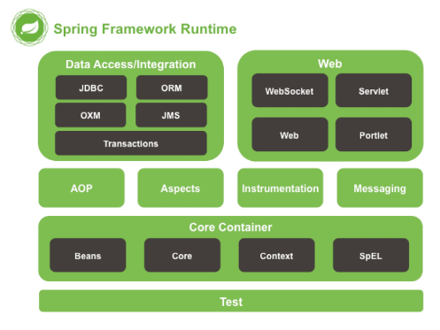
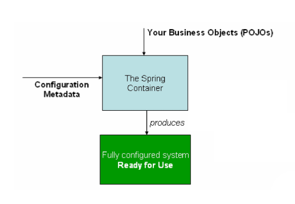
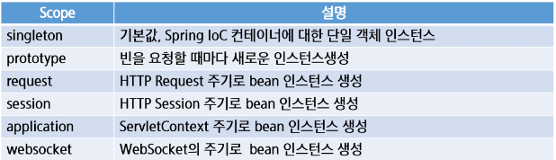

# Spring


### Framework

* 웹 어플리케이션 개발을 위해서 많은 기능을 설계, 잘성해야한다. 하지만 **기본적인 공통 구조(framework)를 제공**한다면 개발자는 웹 어플리케이션 기능 자체 개발에만 집중하여 **생산성 높아진다.**

* 개발자 입장에서 완성된 구조에 자신이 맡은 코드만 개발해서 넣어주면 되기 때문에 **개발 시간 단축**이 가능하다.


### Spring Framework의 특징

> 객체 관리 컨테이너

* POJO(Plain Old Java Object)방식의 프레임워크
  * EJB가 기능 작성 위하여 인터페이스를 구현하거나 상속하는 것에 비해 일반적인 자바 객체를 이용, 그대로 사용 가능
* 의존성 주입을 통한 객체관계 구성
  * 프레임워크 내부에서 사용되는 객체간 의존성이 존재할 경우, 개발자는 의존성에 관련한 설정만 해주면 실제 의존성 생성은 프레임워크가 담당한다.
* 관점지향 프로그래밍(AOP) 지원
  * 트랜젝션, 로깅 등 여러 모듈에서 공통적으로 사용하는 기능 대해 별도로 분리하여 작성, 관리하는 기능 제공
* 제어 역전
  * 객체 및 프로세스의 제어를 프레임워크가 담당한다. 필요에 따라 개발자의 코드 호출
* 높은 확장성과 다양한 라이브러리 제공


### Spring Framework 사용 이유

* Spring is everywhere
  * 전자정부 표준프레임워크 

* Spring is flexible
* Spring is productive


### Spring Framework 아키텍쳐



### DI(Dependency Injection) : 의존성 주입

##### 의존성(Dependency)

* ClassA 객체가 어떤 일을 처리하기 위해서 ClassB의 객체의 도움을 받아야만 일을 처리할 수 있다면 `ClassA는 ClassB에 의존한다.`라고 표현한다.

```java
public class Store{
	private Item obj = new ItemImp();
    public void doSomething(){
        obj.func();
    }
}
```

* ClassA가 ClassB의 객체를 사용하기 위해서 클래서 내부에서 직접 객체를 생성(의존성 생성, 강한 결합)

##### 의존성 주입

* 사용 객체에 대하여 직접 의존성을 생성하는 것이 아니라, 생성자, 팩토리 메서드, 세터 등을 이용하여 종속성을 정의

```java
public class Store {
    private Item obj;
    public void setItem(Item item){
        obj = item;
    }
    public void doSomething(){
        obj.func();
    }
}
```

* 종속성에 대한 인스턴스화를 직접 제어 하지 않고 이를 역전 시키기 때문에 이러한 프로세스를 제어 역전 이라한다.


### Spring IoC Container

* 스프링 프레임워크는 IoC원칙에 따라 설계

##### IoC Container



##### Container

* Bean의 인스턴스화 조립, 관리의 역할, 사용 소멸에 대한 처리 담당
  * Bean : 스프링에서 핵점적인 역할을 하는 객체
* BeanFactory
  * 프레임워크 설정과 기본기능 제공하는 컨테이너
  * 모든 유형의 객체 관리할 수 있는 메커니즘 제공
* ApplicationContext
  * BeanFactory 하위인터페이스
  * 이벤트 처리, 국제화용 메시지 처리, AOP 통합 기능 제공
* WebApplicationContext
  * 웹 환경에서 Spring을 사용하기 위한 기능에 추가됨
  * 대표적인 구현 클래스 : XmlWebApplicationContext


### 스프링 설정 정보(Spring configuration metadata)

* 애플리케이션 작성 위해 생성할 Bean과 설정 정보, 의존성 등 방법을 나타내는 정보
* 설정정보를 작성하는 방법 : XML, Annotation, Java


### DI(Dependency Injection)

* 빈(Bean) 생성 및 설정 : xml 방식

  * Bean 생성 : 생성자

  ```html
  <bean id="store" class="com.ssafy.common.Store"></bean>
  ```

  ```
  id : 스프링컨테이너에서 사용할 bean 식별자
  class : 객체화할 객체의 클래스의 전체 경로
  ```

  * Bean 생성 : static factory-method

    ```java
    public class Store {
        private static Store store = new Store();
        private Store(){}
        public static Store getInstance(){
            return store;
        }
        ...
    }
    ```

    ```html
    <bean id="store" class="com.ssafy.common.Store" factory-method="getInstance"></bean>
    ```

  * 의존성주입 : 생성자 base

    * constructor-arg를 이용하여 의존성 주입을 설정

  * 의존성주입 : setter base

    * setter 메서드를 이용하여 의존성 주입

#### Bean Scope

* Bean 정의를 작성하는 것은 Bean 객체를 생성하는 것과 다르다
* Bean 범위를 정의해서 객체의 범위를 제어할 수 있다.
* Scopes

​	

* request, session, application, websocket은 web 환경에서 사용가능