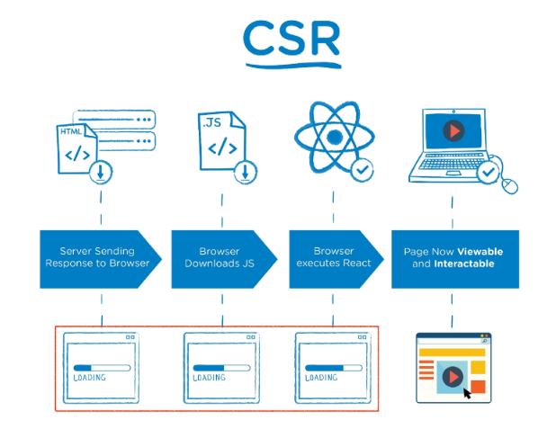
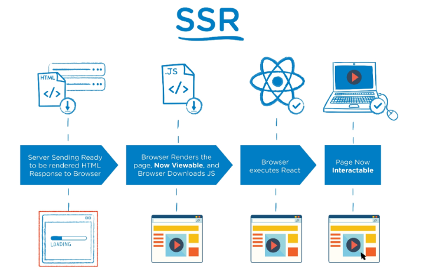

# Vue

* 사용자 인터페이스를 만들기 위한 진보적인 자바스크립트 프레임워크

* SPA(Single Page Application)

  * 단일 페이지 애플리케이션
  * 현재 페이지를 동적으로 렌더링하여 사용자와 소통하는 웹 애플리케이션
  * 최초에만 페이지를 다운로드하고, 이후에는 동적으로 DOM 구성
  * 연속되는 페이지 간의 사용자 경험(UX)를 향상
    * 모바일 사용량 증가에 따라 트래픽 감소와 속도, 사용성, 반응성 향상은 매우 중요하기 때문
  * 동작 원리의 일부가 CSR(Client Side Rendring)의 구조를 따름

* CSR(Client Side Rendering)

  * 처음에 뼈대만 받고 브라우저에서 동적으로 DOM 그림

    

  * 클라이언트가 html을 만든다.
  * 장점
    * 서버와 클라이언트간 트래픽 감소
    * 사용자 경험(UX) 향상
  * 단점
    * SSR에 비해 전체 페이지 최종 렌더링 시점이 느림
    * SEO(검색 엔진 최적화)에 어려움이 있음 (최초 문서에 데이터 마크업이 없기 때문)

* SSR(Server Side Rendering)

  * 서버에서 클라이언트에게 보여줄 페이지를 모두 구성하여 전달하는 방식

  

  * 서버가 html을 만들어준다.
  * 장점
    * 초기 구동 속도 빠름
  * 단점
    * 모든 요청마다 새로운 페이지를 구성하여 전달


### Vanilla JS vs Vue.js

* Vanilla JS
  * 한 유저가 작성한 게시글이 DOM상에 100개 존재
  * 이 유저가 닉네임을 변경하면, DB의 Update와 별도로 DOM상의 100개의 작성자 이름이 모두 수정되어야 함
  * '모든 요소'를 선택해서 '이벤트'를 등록하고 값은 변경해야 함
* Vue.js
  * DOM과 Data가 연결되어 있고
  * Data를 변경하면 이에 연결된 DOM은 알아서 변경
  * 우리가 신경써야 할 것은 오직 Data에 대한 관리(Developer Exp 향상)


#### Concepts of Vue.js

* MVVM Pattern
  * view : html
  * viewModel : Vue(DOM과 DATA의 중개자)
  * model : {key:value}(javaScript object)


#### Django & Vue.js 코드 작성 순서

* Django
  * 데이터의 흐름
  * url => views => template
* Vue.js
  * Data가 변경하면 DOM이 변경
    1. Data 로직 작성
    2. DOM 작성


### quick start of Vue.js

```html
<--선언적 렌더링-->
<div id="app1">
    {{ message }}
</div>

<script>
const app1 = new Vue({
        el: '#app1',
        data: {
            message: '안녕하세요' 
        }
    })
</script>
```

* data의 message 바꾸면 연결된 화면이 바뀌게 된다.


```vue
<--엘리먼트 속성 바운딩-->
<div id="app2">
    {{ message }}
</div>

<script>
const app2 = new Vue({
        el: '#app2',
        data: {
            message: `이 메시지는 ${new Date()}에 로드됨`
        }
    })
</script>
```


```html
<--조건-->

<div id="app3">
    <p v-if="seen">
        보인다
    </p>
    <p v-else>
        안보인다
    </p>
</div>
<script>
const app3 = new Vue({
    el: '#app3',
    data: {
        seen: true,
    }
})
</script>
```

* data를 false로 바꾸면 보이지 않느다.

```html
<--반복-->
    
<div id="app4">
    <ol>
        <li v-for="todo in todos">{{ todo.text }}</li>
    </ol>
</div>
<script>
const app4 = new Vue({
    el: '#app4',
    data: {
        todos: [
            {text: '1'},
            {text: '2'},
    		{text: '3'},
        ]
    }
})
</script>
```

```html
<--사용자 입력 핸들링-->

<div id="app5">
	<p>{{ message }}</p>
    <input v-model="message" type="text">
    <button v-on:click="reverseMessage">거꾸로</button>
</div>
<script>
const app5 = new Vue({
    el: '#app5',
    data: {
        message: '안녕하세요'
    },
    methods: {
        reversedMessage: function(){
            this.message = this.message.split('').reverse().join('')
        }
    }
})
</script>
```


### Vue instance

* 모든 Vue 앱은 Vue 함수로 새 인스턴스를 만드는 것부터 시작
* Vue 인스턴스를 생성할 때는 Options 객체를 전달해야 함
* 여러 Options들을 사용하여 원하는 동작을 구현
* Vue Instance === Vue Component

```vue
const app = new Vue({

})
```

#### Options/DOM - 'el'

* Vue 인스턴스에 연결(마운트)할 기존 DOM 요소가 필요
* CSS 선택자 문자열 혹은 HTML Element로 작성
* new를 이용한 인스턴스 생성 때만 사용

```html
const app = new Vue({
	el: '#app'
})
```

#### Options/DOM - 'data'

* Vue 인스턴스의 데이터 객체
* Vue 인스턴스의 상태 데이터를 정의하는 곳
* Vue template에서 interpolation을 통해 접근 가능
* v-bind, v-on과 같은 directive에서도 사용 가능
* Vue 객체 내 다른 함수에서 this 키워드를 통해 접근 가능

```vue
const app = new Vue({
	el: '#app',
	data: {
		message: 'hello'
	}
})
```

#### Options/Data = 'methods'

* Vue 인스턴스에 추가할 메서드
* Vue template에서 interpolation(중괄호 두개{{}})을 통해 접근 가능
* v-on과 같은 directive에서도 사용 가능
* Vue 객체 내 다른 함수에서 this 키워드를 통해 접근 가능
* 주의
  * 화살표 함수를 메서드를 정의하는데 사용하면 안됨
  * 화살표 함수가 부모 컨텍스트를 바인딩하기 때문에, 'this'는 Vue 인스턴스가 아님.

```vue
const app = new Vue({
	el: '#app',
	data: {
		message: 'hello'
	},
	methods: {
	greeting: function() {
		console.log('hello')
		}
	}
})
```


#### 'this' keyword in vue.js

* vue 함수 객체 내에서 vue 인스턴스를 가리킴
* 단, 화살표 함수를 사용하면 안되는 경우
  * data
  * method 정의

```vue
//생략
<script>
	const app = new Vue({
	el: '#app',
	data: {
		message: 'hello'
	},
	methods: {
        myFunc: function(){
            console.log(this) //Vue instance
        },
        yourFunc: () => {
            console.log(this) // window
        }
	}
})
</script>
```


### Template Syntax

* 렌더링 된 DOM을 기본 Vue 인스턴스의 데이터에 선언적으로 바인딩할 수 있는 HTML 기반 템플릿 구문 사용

1. Interpolation
2. Directive

#### Interpolation(보간법)

* Text 
  * `<span> 메시지: {{ msg }} </span>`
* Raw HTML
  * `<span v-html="rawHtml"></span>`
* Attributes
  * `<div v-bind:id="dynamicId"></div>`
* JS 표현식
  * {{ number + 1 }}
  * {{ message.split('').reverse().join('')}}


#### Directive

* v-접두사가 있는 특수 속성
* 속성 값은 단일 JS 표현식이 됨(v-for 예외)
* 표현식의 값이 변경될 때 반응적으로 DOM에 적용하는 역할 함
* 전달인자(Arguments)
  * `:`  : (콜론)을 통해 전달인자를 받을 수도 있음
* 수식어
  * `.`: (점)으로 표시되는 특수 접미사
  * directive를 특별한 방법으로 바인딩해야 함을 나타냄


##### v-text

* 엘리먼트의 textContent를 업데이트
* 내부적으로 interpolation문법이 v-text로 컴파일 됨

```vue
<div>
    <p v-text="message"></p>
    <!--같음-->
    <p>{{message}}</p> 
</div>

<script>
const app = new Vue({
    el:'#app',
    data: {
        message: 'hello'
    }
})
</script>
```


##### v-html


### SFC (Single File Component)

##### Component

> 재사용 가능한 부품

* 기본 html 엘리먼트를 확장하여 재사용 가능한 코드를 캡슐화 하는데 도움을 줌

* 단일 파일에서의 개발
  * 코드 양 많아지면 유지보수 어려움
  * 한 화면을 구성하는 여러 컴포넌트를 만듦

##### SFC

> .vue 확장자를 가진 파일
>
> html, css, javascript 코드가 다 있다!


##### Vue Component 구조 예시

* 트리 : 사이클이 일어나지 않는 그래프
  * 1번 노드(컴포넌트) : 가장 바깥 프레임
  * 2, 3, 4 번 노드 : 그 안에 박스
  * 그 안의 박스들
  * 조립되는 각 컴포넌트.
* 반드시 파일 단위로 구분되어야 하는 것은 아니지만, 우리는 이렇게 사용함.


### Vue CLI

##### Node.js

* 브라우저가 아닌 환경에서 구동할 수 있도록 하는 자바스크립트 런타임 환경
* 플랫폼

##### NPM (Node Package Manager)

python 에서 pip 같은 존재.

설치 도와준다


#### Babel

* JavaScript compiler
* 자바스크립트 ECMAScript 2015+ 코드를 이전 버전으로 번역/변환해 주는 도구
* 신버전을 구버전으로 번역해줘야 다른 브라우저에서도 작동 가능


#### Static Module Bundler

* 모듈은 단지 파일 하나를 의미
* 라이브러리를 만들어 모듈 불러오거나 코드를 파일단위로 작성하는 노력 생김.
* 여러 모듈 시스템(import 구문)
  * ESM (ECMA Script Module)
  * AMD
  * CommonJS
  * UMD
* 모듈 의존성 문제
  * 모듈의 수가 많아지고 라이브러리 혹은 모듈 간 의존성이 깊어지면서 특정한 곳에서 발생한 문제가 어떤 모듈 간의 문제인지 파악하기 어려움
  * Webpack이 등장하게 됨.

* Bundling : 의존성 해결하는 작업
  * **Webpack**은 Bundler 중 하나


### Pass Props & Emit Events

* components


