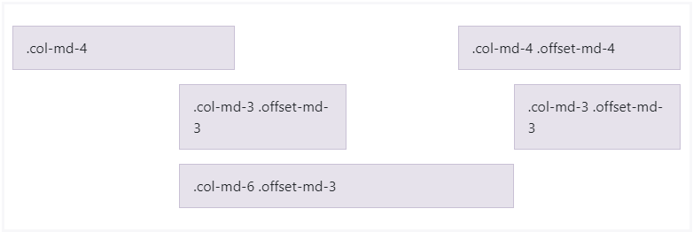

# Bootstrap

### Bootstrap Grid System

#### Grid system

* 기본요소
  * Column: 실제 컨텐츠를 포함하는 부분
  * Gutter: 칼럼과 칼럼 사이의 공간
  * Container: Column들을 담고 있는 공간
* container > rows > column 순!
* 기억해야할 것 2가지!
  * 12개의 칼럼
  * 6개의 grid breakpoints

##### Grid system breakpoints

xs(<576px) : (extra small) .col-

sm(>=576) : (small) .col-sm-

md(>=768) : (medium) .col-md-

lg(>=992) : (large) .col-lg-

xl(>=1200) : (extra large) .col-xl-

xxl(>=1400) : (extra extra large) .col-xxl


##### offset

```html
<div class="row">
  <div class="col-md-4">.col-md-4</div>
  <div class="col-md-4 offset-md-4">.col-md-4 .offset-md-4</div>
</div>
<div class="row">
  <div class="col-md-3 offset-md-3">.col-md-3 .offset-md-3</div>
  <div class="col-md-3 offset-md-3">.col-md-3 .offset-md-3</div>
</div>
<div class="row">
  <div class="col-md-6 offset-md-3">.col-md-6 .offset-md-3</div>
</div>
```


