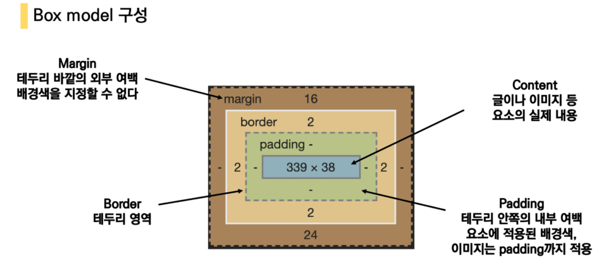
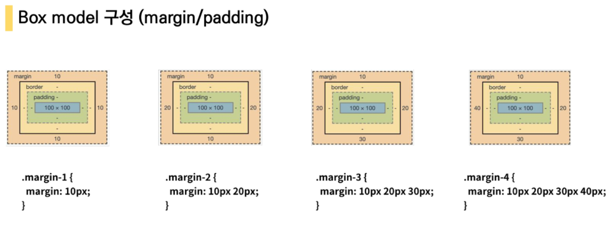

## CSS

> 스타일을 지정하기 위하여 필요한 것?
>
> 선택자
>
> 같은 속성이 다르게 지정되어 있으면 어떻게 선택?
>
> 선택자 우선순위
>
> 태그가 복잡하게 되어있는데 자식에게 상속되는 CSS가 있다.
>
> (아니라면 모두 다 지정 해줘야 함)

CSS : Cascading Style Sheets

스타일을 지정하기 위한 언어

* 각 쌍은 선택한 요소의 속성, 속성에 부여할 값을 의미

  * 속성(property) : 어떤 스타일 기능을 변경할지 결정

  * 값(value) : 어떻게 스타일 기능을 변경할지 결정

  * ```html
    h1 {
    	color: blue;
    	font-size: 15px;
    }   (속성)      (값)
    ```


#### CSS 정의 방법

* 인라인(inline)

  * 해당 태그에 직접 style 속성을 활용

* 내부 참조(embedding)-<style>

  * <head> 태그 내에 <style>에 지정

* 외부 참조 (주로 이것을 사용) - 분리된 CSS 파일

  * 외부 CSS 파일을 <head>내 <link> 통하여 불러오기


#### 선택자

* `*` : 전체 선택
* `태그명` : 요소 선택자
* `class` : class 선택자
* `# id` : id 선택자
* `div > .children` : 자식 선탲가
  * div 태그 바로 밑에 있는 children 클래스를 가진 것
* `div . baby` : 자손 선택자
  * div 태그 하위 모든 baby 클래스를 가진 것

```html
<div>
    <p>빨강</p>
    <p>빨강</p>
    <div>
        <p>I don't want red</p>
    </div>
</div>

div > p {
	color: red;
}
<!--div p { color: red}; 였다면 모든 p tag가 빨강이었을 것-->
```


#### 기본 선택자 우선순위

* `! important` 
* 인라인 `style`
* `*` < `태그명` < `.class` <`#id`
  * 같은 점수일 경우 CSS가 나중에 선언된 것.


#### CSS 상속

* 상속 되는 속성 (눈에 보이는 시각적인 요소)
  * style, text


* 상속 되지 않는 속성
  * margin, box, position


### CSS 기본 스타일

##### 크기

* px (픽셀)
  * 모니터 해상도의 한 화소인 픽셀 기준
  * 픽셀의 크기는 변하지 않으므로 고정된 단위
* %
  * 백분율 단위
  * 가변적인 레이아웃에 사용

* em
  * 바로위, 부모 요소에 대한 상속의 영향 받음
  * 배수단위, 요소에 지정된 사이즈에 상대적인 크기.
* rem
  * 상속의 영향 받지 않음
  * 최상위 요소(html)의 사이즈를 기준으로 배수 단위를 가짐 (기본 16px)

* viewport
  * 웹 페이지를 방문한 유저에게 바로 보이게 되는 웹 컨텐츠의 영역
  * 디바이스의 viewport를 기준으로 상대적인사이즈 결정
  * vw, vh, vmin, vmax


```html
<html lang="en">
<head>
  <title>Document</title>
  <style>
    .em {
      font-size: 1.5em;
    }

    .rem {
      font-size: 1.5rem;
    }
  </style>
</head>
<body>
  <!-- 부모(root => 16px) 대비 1.5배 ul => 24px-->
  <ul class="em">
    <!-- 부모(ul) 대비 1.5배 => 36px-->
    <li class="em">1.5em</li>
    <!--root 대비 1.5배 => 24px-->
    <li class="rem">1.5rem</li>
    <li>no class</li>
  </ul>
</body>
</html>
```


#### 결합자

* 자손 결합자
  * A 하위의 모든 B 요소 (A B {})
* 자식 결합자
  * A 바로 아래의 B 요소 (A > B {})
* 일반 형제 결합자
  * A의 형제 요소 중 뒤에 위치하는 B 요소를 모두 선택 (A ~ B{})
* 인접 형제 결합자
  * A의 형제 요소 중 바로 뒤에 위치하는 B  요소 선택 (A + B {})


### CSS Boxmodel

> 모든 요소가 네모
>
> 위에서 아래로, 왼쪽에서 오른쪽으로

* box model 구성요소
  * contents : 글이나 이미지 등 요소의 실제 내용
  * padding : 테두리 안쪽의 내부 여백 요소에 적용된 배경색. 이미지는 padding까지 적용
  * border : 테두리 영역
  * margin : 테두리 바깥의 외부여백. 배경색 지정 불가



* box model 너비지정(`box-sizing`)

> 너비 지정할건데 기준을 무엇으로 할것인지?



(shorthand로 표현)

```css
/*.border{
	border-width: 2px;
	border-style: dashed;
	border-color: black;
}*/
.border{
    border: 2px dashed black
}
```

###### box-sizing

* 기본적으로 box-sizing은 content의 사이즈 
  * padding을 제외한 순수 contents 영역만을 box로 지정

* box-sizing을 border-box로 설정하면 border까지의 너비를 봄


### CSS Display

> 모든 요소는 네모(박스모델)이고, 좌측 상단에 배치
>
> display에 따라 크기와 배치가 달라진다.

* display: block 
  * 아래로 쌓임
  * 줄 바꿈
  * 화면 크기 **전체**의 가로 폭을 차지
  * 블록 레벨 요소 안에 인라인 레벨 요소가 들어 있음.
    * `div / ul, ol , li /p / hr / form`
  * block : 너비를 가질수 없다면 자동으로 margin이 부여됨.
* display: inline
  * 우측으로 쌓임 
  * 줄 바꿈 일어나지 않는 행의 일부 요소
  * **content 너비**만큼 가로 폭 차지
  * **width, height, margin-top, margin-bottom 지정 불가**
    * 정의가 content 너비만큼만 차지하므로 
  * 상하 여백 : line-height로 지정
    * `span / a / img / input, label / b, em, i, strong`

```css
margin-right: auto;
text-align: left;

margin-left: auto;
text-align: right;

margin-right: auto;
margin-left: auto;
text-align: center;
```

* display: inline-block
  * block과 inline 레벨 요소의 특징
  * inline처럼 한줄에 표시 가능
  * block처럼 width, height, margin 속성 지정 가능
* none
  * 화면에표시하지 않고, 공간 부여 X
  * visibility: hidden 이 공간 부여되는 것과 다르게 영역을 차지하지 않음.


### CSS Position

* static : 모든 태그의 기본 값
  * 일반적인 요소의 배치 순서에 따름 (좌측 상단)
  * 부모 요소 내에서 배치될 때는 부모 요소의 위치를 기준으로 배치.

* 좌표 프로퍼디(`top, bottom, left, right`) 사용하여 이동 가능
  * relative : 상대위치
    * 기존 위치(static 위치) 기준으로 이동
    * 레이아웃에서 요소가 차지하는 공간은 static과 같음
  * absolute : 절대위치
    * 일반적인 흐름에서 제거 후 레이아웃에 공간 차지 않음
    * static 아닌 가장 가까이 있는 부모 요소를 기준
    * normal flow에서 벗어나 부모 요소를 기준으로 위치
  * fixed : 고정위치
    * 스크롤 시에도 항상 같은 위치
    * viewport 기준으로 위치


##### chrome devtools (ctrl + shift + i)

* view and chages css
